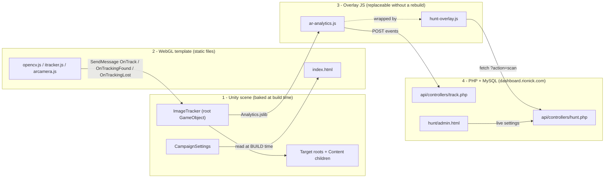
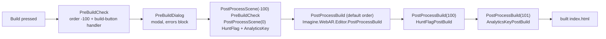
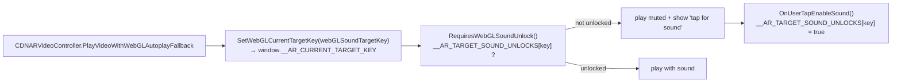

# ARRISE Platform Architecture

> **Job:** how an ARRISE campaign is built and served — the four layers, the build
> pipeline that wires them together, and the constraints that break a build when
> broken.
> **Update when:** a build hook, a scene builder, the WebGL template contract, or
> one of the hard constraints changes.
> **Do NOT put here:** the AR Meme Hunt game rules, its HUD, its scoring or its
> server contract — those belong to `HUNT-ENGINE.md`. Portable Unity rules belong
> in [../Engineering](../Engineering/).

---

## Purpose

ARRISE is a WebAR campaign platform. A campaign is a **Unity 6000.3.9f1 WebGL
build**, served as a plain static folder on shared hosting, that opens the phone
camera, recognises a printed image, and plays content on top of it. Nothing is
installed and nothing is an app.

The stack is deliberately split so that most changes do **not** cost a Unity
rebuild. Unity owns what is baked (image targets, ids, meshes); the WebGL template
and its JavaScript own the page; the PHP backend owns everything that changes
during a live event.

Two campaign shapes exist today:

| Shape | What it is | `huntEnabled` |
|---|---|---|
| Plain AR experience | Visiting card, poster, product demo. The AR content is the whole thing. | `false` |
| AR Meme Hunt | Timed / untimed / points scavenger hunt across printed posters at a trade event. Registration gate, chips, timer, leaderboard. | `true` |

Both ship from the same template and the same overlay file. What separates them is
one line in the built `index.html`, and that line is written by a build hook —
never by hand.

---

## The four layers



Who owns what:

| Layer | Lives in | Owns | Changing it costs |
|---|---|---|---|
| Unity scene | `Assets/Scenes_1/*.unity` | Target ids, meshes, physical sizes, video URLs, campaign declaration | A Unity rebuild |
| WebGL template | `Assets/WebGLTemplates/iTracker`, `iTracker6` | The page, the camera, the tracking engine, the iOS sound unlock, the crash watchdog | A rebuild, **or** editing the uploaded `index.html` |
| Overlay JS | `hunt-overlay.js` in both templates | All hunt UI and all hunt networking | Upload one file + bump `?v=N` |
| PHP API | `ar-analytics/` | Participants, scans, scoring, poster list, labels, hints, ads, open/close | Upload the PHP, or edit live in the admin panel |

Two rules follow from the table, and both have been broken before:

- **Do not put hunt UI in the Unity scene.** The overlay hooks
  `window.arAnalytics.arImageFound` (which `Analytics.jslib` already calls from
  `ImageTracker.OnTrackingFound`), so no C# change is needed for any hunt UI work —
  and anything in the scene needs a rebuild and an upload to fix mid-event.
- **Do not hard-code the poster list on the server.** Unity owns the ids because
  they are baked into the build and cannot change after it ships. The server
  *learns* them from the exported `hunt-posters.json`.

---

## The build pipeline

### Scene builders

A campaign scene is **generated**, not hand-assembled. Each builder clones a
template scene, strips its demo content, and constructs every tracked target by
the same rules, so target #6 is exactly as trustworthy as target #1. All of them
are idempotent: re-running deletes and re-creates the scene.

| Tool | File | Builds | Notes |
|---|---|---|---|
| `Tools ▸ Meme Hunt ▸ 1. Build MemeHunt Scene` | `Assets/Editor/MemeHuntSceneBuilder.cs` | `Assets/Scenes_1/MemeHunt.unity` | Posters are **discovered** from `Assets/AR_Assets/AR Meme Hunt` by their leading number. Drop a file in, rebuild. Adds `CampaignSettings` with `huntEnabled = true` and exports `hunt-posters.json`. |
| `Tools ▸ Rishabh ▸ Build Rishabh Scene` | `Assets/Editor/RishabhSceneBuilder.cs` | `Assets/Scenes_1/Rishabh.unity` | Visiting card. Two targets (front and back), each with a full duplicate of the content and a world-space UI Canvas. `huntEnabled = false`. |
| `Tools ▸ AR Card Setup Wizard` | `Assets/Editor/ARCardSetupWindow.cs` | A new card scene, interactively | Older wizard. Does **not** add `CampaignSettings`, does **not** build a `Content` child, and leaves the target root **active** — see the constraints below. |
| `Tools ▸ AR Setup Automation` | `Assets/Editor/ARAutomationWindow.cs` | A new video scene, interactively | Older wizard, same caveats. Green-screen mode uses a parent/child mesh pair. |
| `Tools ▸ Rishabh ▸ Sync UI To All Targets` / `Read Layout From Scene` | `Assets/Editor/RishabhLayoutTools.cs` | — | Copies the hand-arranged card UI onto the other target, then writes the arrangement back into `RishabhSceneBuilder.cs` between its `LAYOUT AUTO-BEGIN/END` markers so the next rebuild does not wipe it. |
| `Tools ▸ Custom Plane Generator` | `Assets/Editor/CustomPlaneGenerator.cs` | A quad mesh asset | Standalone helper. |

New work goes into a builder in the `MemeHuntSceneBuilder` / `RishabhSceneBuilder`
shape. The two wizards are kept for existing scenes.

### What happens when you press Build



What each hook writes into the built `index.html`:

| Hook | Reads | Writes |
|---|---|---|
| `Imagine.WebAR.Editor.PostProcessBuild` | `ImageTrackerGlobalSettings.imageTargetInfos` | Copies every target image into `<build>/targets/` **by file name**, then injects one `<imagetarget id='…' src='targets/…'>` tag per target at the `<!--IMAGETARGETS-->` marker |
| `HuntFlagPostBuild` | `CampaignSettings.huntEnabled` | Rewrites `window.HUNT_CONFIG = { enabled: true\|false };` |
| `AnalyticsKeyPostBuild` | `CampaignSettings.analyticsApiKey` | Rewrites `data-project="…"` on the `ar-analytics.js` tag — **or removes the whole tag** when the key is empty |

The Imagine hook uses the attribute's default callback order, so it runs before
100 and 101: the other two patch an `index.html` that already has its target tags.

`PreBuildCheck` (`Assets/Editor/PreBuildCheck.cs`) is the gate in front of all of
it, and it runs twice on purpose: as a modal window at the Build button
(`BuildPlayerWindow.RegisterBuildPlayerHandler` plus `IPreprocessBuildWithReport`,
covering both doors into a build), and as `[PostProcessScene(-100)]`, which sees the
real boot scene and throws `BuildFailedException` even if the window was skipped.
Every rule in it comes from something that already shipped broken and silently — a
compressed build with no decompression fallback that hangs at "Loading…", a
`VideoClip` baked into the build, a target missing from the global registry, a
mis-pasted analytics key.

### CampaignSettings — the per-scene declaration

```csharp
// Assets/Scripts/CampaignSettings.cs
public bool   huntEnabled     = false;  // hunt overlay ON/OFF for this build
public string campaignName    = "";     // humans only, unused by the build
public string analyticsApiKey = "";     // 64 hex chars, or empty = no analytics
```

One component, on one object, anywhere in the scene. There is **no central list of
scene names** anywhere in the project: the scene answers "what kind of campaign am
I?" itself, so adding a campaign, renaming a scene or moving a folder changes
nothing in the build hooks.

A scene with no `CampaignSettings` behaves as `huntEnabled = false`. That is the
safe default in the direction that matters: a client's visiting-card build can
never accidentally show somebody else's game HUD. Both scene builders write the
key into `CampaignSettings` from a constant in the builder, because rebuilding
deletes and re-creates the scene — a key typed only into the Inspector is lost on
the next rebuild.

### BootSceneCampaign — the disk fallback, and why it exists

`[PostProcessScene]` is the only place a scene's own components can be inspected,
because it runs with the scene loaded. **It is not guaranteed to run.** Unity skips
scene processing when an incremental build reuses cached scene data.

When it is skipped, the statics that `HuntFlagPostBuild` and `AnalyticsKeyPostBuild`
fill stay null, and the post-build step falls back to its "nothing was declared"
default — which wrote

```html
<script>window.HUNT_CONFIG = { enabled: false };</script>
```

into a Meme Hunt build. The result ships with no registration gate, no chips, no
timer and no scoring, and looks like a perfectly healthy AR build. Worse, it does
not self-correct: once the scene stops being reprocessed, **every** later build is
wrong the same way. That happened for six consecutive builds during a live event
(`Editor.log` shows `scene: <unknown>` on each).

`Assets/Editor/BootSceneCampaign.cs` removes the dependency on the callback. Unity
builds the player from the scene **files**, so it reads the file: take the first
**enabled** entry in Build Settings (the scene the build boots), split the `.unity`
text on `^--- ` (YAML document separators), keep documents matching the
`CampaignSettings` script GUID — falling back to the `::CampaignSettings` identifier
Unity also writes, so a re-imported script with a new GUID still resolves — and
regex out `huntEnabled`, `analyticsApiKey`, `campaignName`.

A file read cannot silently not happen. It does require text-serialized scenes
(`Project Settings ▸ Editor ▸ Asset Serialization ▸ Force Text`); if that is ever
turned off, `Found` comes back false and both callers log loudly instead of guessing.

The build console is the record: read the `[HuntFlag]` and `[Analytics]` lines after
every build. Both name the scene and where the answer came from.
`read from: scene file on disk — PostProcessScene did not run this build` is normal
and correct. A `[HuntFlag]` **error** saying no `CampaignSettings` could be read is
not — it means the flag defaulted to OFF.

---

## The AR runtime

### How a tracked target is structured

```text
ImageTracker                 root GameObject, named exactly "ImageTracker"
└── Target1                  target root — INACTIVE in the saved scene
    │                        MeshFilter + MeshRenderer (the tracking quad)
    └── Content              ARContentScale — everything visible hangs off HERE
        ├── Target1 vid      MeshFilter + MeshRenderer + VideoPlayer
        │                    + CDNARVideoController
        └── World Canvas     world-space UI (visiting cards only)
```

The tracker normalises a target's **width** to 1.0 world unit, so a target is
`1.00 × (imageHeight / imageWidth)`. Physical size therefore lives in the *mesh*,
generated per target, and the transforms stay identity.

Z convention: quad normals are `Vector3.back` and the camera looks down `+Z`, so
**more negative Z is closer to the camera**. The tracking quad sits at `z = 0.000`
and the video plane at `z = -0.010`.

`ImageTracker` must stay a root GameObject with that exact name: `itracker.js`
delivers tracking through `unityInstance.SendMessage(<name>, 'OnTrack' | …)`, and
the page's crash watchdog restarts tracking with
`SendMessage('ImageTracker', 'StopTracker')`. `ImageTracker.Start()` logs an error
if it has a parent; `PreBuildCheck` blocks the build.

### CDNARVideoController — streaming from jsDelivr

`Assets/Scripts/CDNARVideoController.cs`. Videos are **never** baked into the build
(`PreBuildCheck` treats an assigned `VideoClip` as a blocking error — every visitor
would download it before the experience starts). They stream from a public GitHub
repo through jsDelivr, e.g.
`https://cdn.jsdelivr.net/gh/prashant1998gupta/AR_ImageTracking@main/videos/ARMemeHuntVideos/Target-1.mp4`.
Spaces in a file name must be `%20` — a raw space 404s on jsDelivr. `http://` is a
blocking error: the page is https, so the browser blocks the video as mixed content.

The controller does three non-obvious things:

- **The persistent player.** `Awake()` creates a separate `PersistentVP_<name>`
  GameObject, marks it `DontDestroyOnLoad`, moves a clone of the `VideoPlayer` onto
  it, disables the original, and calls `Prepare()` immediately. The tracker
  deactivates the target root on tracking-lost, which would tear down a normal
  player's WebGL buffer; keeping the player on a live object means a re-track
  resumes instantly with no re-buffering. `OnEnable` plays, `OnDisable` pauses.
- **White-flash suppression.** The video renderer starts disabled and is only
  enabled once `IsVideoTextureReady()` confirms the decoded texture is on the
  material (larger than the placeholder). Without it a chroma-key shader sees white
  and clips nothing. `fastLoadMode = true` skips the hold when the extra frame
  matters more than the flash.
- **The iOS sound unlock.** See the fourth constraint below.

`cdnVideoUrl` wins over the in-scene `VideoPlayer.url`. `Awake()` clones
`url → source → clip` in that order, so the builders set `source` explicitly.

### ARContentScale — `?scale=` without a rebuild

`Assets/Scripts/ARContentScale.cs` sits on the `Content` object. In `Start()` it
reads `Application.absoluteURL` (which carries the full query string in a WebGL
build, so no JS plugin is needed), looks for `scale` or `ar_scale`, clamps to
`[minScale, maxScale]` (0.05 – 5), and writes `transform.localScale`. So
`https://your-host/rishabh/?scale=0.58` retunes the content live.

Getting "the AR matches the printed card" right is a judgement call that can only be
made on a phone, against the real card, in real light. Before this component every
guess cost a rebuild **and** an upload, so the number got guessed instead of
measured. Now: try values on the phone in seconds, then bake the winner into the
builder's `ContentScale` and rebuild once. With no `?scale=` in the URL the
serialized value is used, so a shipped build behaves exactly as authored.

---

## Hard constraints

Each of these is a real, verified failure mode in this repo. All four are silent:
the build succeeds and the page loads.

### Put every authored size, position and rotation on a child, never on the target root.
`breaks things` · `junior trap`

**Why** — `ImageTracker.ParseData()` runs for the tracked id on **every tracked
frame** and hard-assigns the root's transform:

```csharp
// Assets/Imagine/ImageTracker/Scripts/ImageTracker.cs
if (trackerCam.isFlipped) { ... target.localScale = flippedScale; }   // (-1, 1, 1)
else                      {     target.localScale = Vector3.one;  }
...
target.position = newPos;
target.rotation = newRot;
```

Anything authored on the root survives exactly until the first tracked frame, then
snaps away. In the Editor everything looks correct, because `ParseData` never runs.

```csharp
// ✗ wiped on the first tracked frame
targetRoot.transform.localScale = Vector3.one * 0.625f;

// ✓ the tracker owns the root; a child owns the size
targetRoot.transform.localScale = Vector3.one;          // identity, always
contentObj.transform.SetParent(targetRoot.transform, false);
contentObj.transform.localScale = Vector3.one * 0.625f; // ARContentScale lives here
```

Physical size that must not be scalable at all belongs in the **mesh** — that is
why both builders generate a per-target quad mesh instead of scaling a shared one.

**Spot it:** any non-identity `localScale`, `localPosition` or `localRotation` on a
Transform listed in `ImageTracker.imageTargets`.

### Every target root must carry a Renderer.
`breaks things`

**Why** — `ImageTracker.Start()` dereferences it with no null check:

```csharp
foreach (var i in imageTargets)
{
    targets.Add(i.id, i);
    i.transform.GetComponent<Renderer>().enabled = false;   // ← no null check
    i.transform.gameObject.SetActive(false);
    serializedIds += i.id;
    ...
}
```

The damage is not limited to that one target. The `NullReferenceException` escapes
the loop, so no later target is added to `targets`, `serializedIds` is left
truncated, and `StartWebGLiTracker(serializedIds, name)` below is never reached:
**nothing tracks at all**. In the browser this reads as "the camera opens and
nothing ever happens".

```csharp
// ✓ mandatory, even though this material is never seen
targetObj.AddComponent<MeshFilter>().sharedMesh = GetOrCreateMesh(w, h, id + "_TrackImg");
targetObj.AddComponent<MeshRenderer>().sharedMaterial = trackingImageMaterial;
```

The renderer is disabled on the very next statement, so the material exists only to
make the target visible while authoring in the Editor.

**Spot it:** a target root with no `MeshRenderer` in the Inspector.

### Target roots must be saved INACTIVE.
`breaks things` · `junior trap`

**Why** — `ImageTracker` deactivates the roots in `Start()`, and Unity runs **every**
`Awake` and `OnEnable` in the scene before **any** `Start`. So for an active root the
order is:

1. `CDNARVideoController.Awake()` — builds the persistent player and calls
   `Prepare()`, which begins the CDN download.
2. `CDNARVideoController.OnEnable()` — calls
   `PlayVideoWithWebGLAutoplayFallback()` → `videoPlayer.Play()`.
3. *only then* `ImageTracker.Start()` → `SetActive(false)` → `OnDisable()` → pause.

Every target's video therefore starts downloading and playing at page load, before
anything has been scanned — and `Start()` ordering between different objects is
undefined, so how much of that is audible is not deterministic. On a five-poster
hunt that is five concurrent video streams competing for venue Wi-Fi.

```csharp
// ✓ last line of every target builder
targetObj.SetActive(false);
```

The same trap has a second door: a GameObject parented under `ImageTracker` but
**not** listed in `imageTargets` is never deactivated by anything, because the loop
above only walks the list. `MemeHuntSceneBuilder` destroys such strays with a
warning for exactly this reason.

**Spot it:** any child of `ImageTracker` ticked active in the Hierarchy.
`ARCardSetupWindow` and `ARAutomationWindow` do not call `SetActive(false)` — scenes
from those wizards need it applied by hand.

### `webGLSoundTargetKey` must equal the tracker id.
`breaks things` · `junior trap`

**Why** — on iOS Safari (`IsAppleMobileBrowser()` in `index.html`) autoplay with
sound is refused, so the page runs a per-target unlock handshake:



That key is the **only** thing linking "the visitor already tapped" to "this video
may have sound". Two ways it goes wrong:

- **Left empty.** `Awake()` falls back to `ResolveWebGLSoundTargetKey()`, which
  returns `transform.parent.name`. Under the builders' hierarchy the parent is
  literally `Content` for *every* target, so all targets collapse onto one shared
  key and the per-target unlock stops being per-target.
- **Set to something other than the tracker id.** `ImageTracker.OnTrackingFound`
  calls `SetActive(true)` — which runs `OnEnable`, and therefore the whole play
  path above — and only *afterwards* broadcasts
  `OnWebGLTargetTrackingStateChanged(id)`, which is what overwrites
  `webGLSoundTargetKey` with the real id. So the **first** acquisition of a target
  files the visitor's unlock under the authored key, and the next acquisition asks
  for the tap again under the tracker id.

```csharp
// ✗ derived at runtime → "Content" for every target
// (leave the field empty)

// ✓ MemeHuntSceneBuilder.cs / RishabhSceneBuilder.cs / ARCardSetupWindow.cs
cdn.webGLSoundTargetKey = p.id;    // exactly the ImageTracker id
```

Nothing catches a wrong key automatically. `PreBuildCheck`'s sound-key warning only
fires when the controller's **parent** is itself a scene target id, and the
`Content` container in between means it never is. This has to be correct by
construction in the builder.

**Spot it:** any `CDNARVideoController` whose `webGLSoundTargetKey` is empty or is
not exactly one of `ImageTracker.imageTargets[].id`.

---

## Adding a new campaign, end to end

1. **Prepare the target images.** Roughly 1000–1600 px on the long edge — tracking
   uses features, not pixels, and every registered image is downloaded and
   feature-extracted before the camera opens. Ids must match
   `^[A-Za-z0-9_-]{1,64}$` (no spaces). **Image file names must be unique across
   every registered target**: `PostProcessBuild` copies them into
   `<build>/targets/` by file name, and a collision silently overwrites one.
2. **Put the video on the CDN.** Commit it under `videos/` and push; jsDelivr
   publishes it at `…/gh/<user>/<repo>@main/videos/<file>`. `https://` only; encode
   spaces as `%20`.
3. **Generate the scene** with the right builder (table above). For a hunt, drop the
   posters into `Assets/AR_Assets/AR Meme Hunt` named with their hunt order and run
   `Tools ▸ Meme Hunt ▸ 1.`; for a card, configure `RishabhSceneBuilder`'s CONFIG
   block or use the wizard.
4. **Check the campaign declaration.** One `CampaignSettings` in the scene;
   `huntEnabled` correct; `analyticsApiKey` either empty (ships with no analytics —
   the tracker tag is removed) or exactly the 64 hex characters from
   `Admin ▸ Projects ▸ API Key`. Put the key in the builder's constant too, or the
   next rebuild loses it.
5. **Hunts only: hand the ids to the server.** `Tools ▸ Meme Hunt ▸ 3. Copy Poster
   List JSON` writes `<projectRoot>/hunt-posters.json`; paste it into
   `hunt/admin.html ▸ Settings ▸ Poster list`. Skip this and the server scores
   against its own built-in ids — the camera tracks the poster and the video plays,
   but the scan is rejected with `400` and the chip never ticks. The overlay logs
   `[Hunt] POSTER ID MISMATCH` in the browser console when it detects this.
6. **Player Settings.** WebGL platform; `WebGL Template = iTracker` (or `iTracker6`).
   Any other template has no `arcamera.js` / `itracker.js` and nothing tracks.
7. **Build Settings.** Exactly one enabled scene, and it must be this campaign —
   both build hooks read only the **first** enabled scene.
8. **Run `Tools ▸ ARRISE ▸ Pre-Build Check`** and clear the errors. Most have a
   one-click fix in the dialog.
9. **Build.** Read the `[HuntFlag]` and `[Analytics]` console lines before doing
   anything else.
10. **Verify the built `index.html`** — `window.HUNT_CONFIG`, `data-project`, and one
    `<imagetarget>` tag per target.
11. **Upload the build folder** to its own directory on the host.
12. **Restore the shared global target list** if the pre-flight's "Trim to this
    scene" fix was used — it edits an asset every campaign shares:
    `git checkout -- Assets/Imagine/ImageTracker/Resources/ImageTrackerGlobalSettings.asset`

---

## Deployment: rebuild versus upload

The whole layering exists so that the answer to most questions is "upload a file".

| I changed… | Unity rebuild? | What to do |
|---|---|---|
| Hunt UI, HUD, scan flow, victory card | **No** | Edit `hunt-overlay.js` in **both** templates, bump `?v=N` in both `index.html`, upload `hunt-overlay.js` + `index.html` to the live build folder |
| Poster labels, hints, mode, anti-cheat floors, sponsor ads, open/close a target | **No** | `hunt/admin.html ▸ Settings` — live, from a phone, mid-event |
| Hunt API, landing page, leaderboard, admin panel, analytics dashboard | **No** | Upload the changed PHP/HTML under `ar-analytics/` |
| A campaign video | **No** | Replace the file under `videos/`, commit and push — see the jsDelivr note below |
| Content scale, while tuning | **No** | `?scale=…` on the URL |
| Content scale, as the shipped default | **Yes** | Bake it into the builder's `ContentScale`, rebuild |
| Analytics key or hunt flag | **Yes** (or hand-edit the uploaded `index.html`) | `CampaignSettings`, rebuild |
| Target images, ids, meshes, scene structure, C# | **Yes** | Re-run the builder, rebuild |

### The `?v=N` cache-buster is not optional

`hunt-overlay.js` is a static file and phones cache it aggressively. Editing it
without bumping `?v=N` means everyone who already opened the build keeps the **old**
overlay — the change looks like it never shipped. `PreBuildCheck.CheckOverlaySync`
guards both halves: it warns (with a one-click copy) when `iTracker` and `iTracker6`
have drifted apart, and it stores the file's hash in `EditorPrefs` keyed by the
current `?v=` number, raising a **blocking error** with a one-click bump if the file
changed while the number did not. The uploaded build's own `index.html` is a
separate copy and must be bumped there too.

### The jsDelivr `@main` cache

The video URLs pin a **branch**, not a tag or a commit:
`cdn.jsdelivr.net/gh/prashant1998gupta/AR_ImageTracking@main/videos/…`

jsDelivr caches a branch reference for **up to 12 hours**. Overwriting a file at the
same path therefore does not swap the video on visitors' phones for up to half a
day, and no amount of reloading helps. To swap a clip in a hurry, **ship it under a
new file name** (and rebuild, or hand-edit the URL), or purge the path through
jsDelivr's purge endpoint. Never plan an event-day content swap around an in-place
overwrite.

### Hosting notes

Builds sit on plain shared hosting, which is why `PreBuildCheck` blocks two Player
Settings: **Decompression Fallback must be on** whenever compression is enabled (the
host does not send `Content-Encoding` for `.br` / `.gz`, and the page then hangs at
"Loading…" forever), and **WebGL multithreading must be off** (it needs COOP/COEP
headers the host does not send, and without cross-origin isolation the build refuses
to start). Data Caching should be on — at an event most visitors open the same build
more than once.

The backend lives at `dashboard.rionick.com`; `ar-analytics/.htaccess` routes
`^api/(.*)` into `api/index.php`, passes `tracker/`, `dashboard/`, `admin/` and
`hunt/` straight through, and blocks `api/config.php`, `api/helpers/` and `sql/`.
