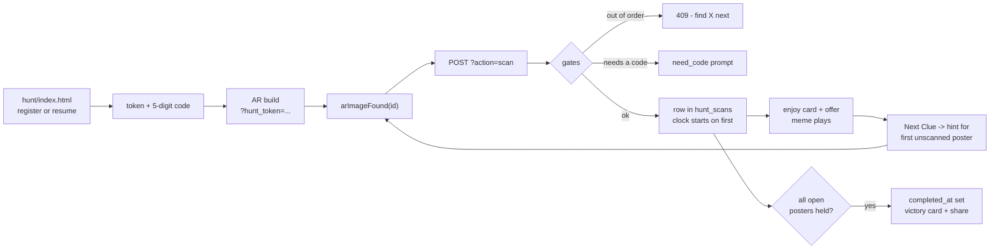
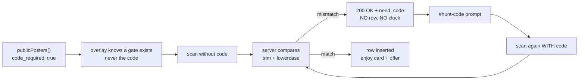
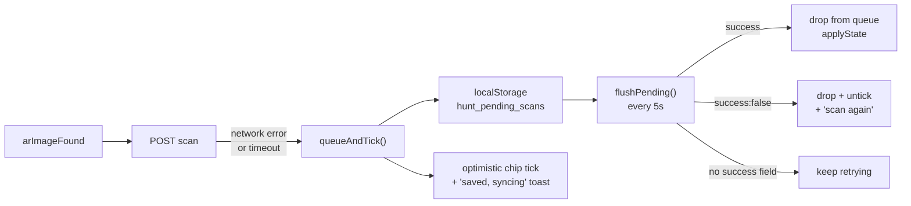

# Hunt Engine

> **Job:** the source of truth for the campaign engine - the data model, every
> API action, the three event modes, the engagement gates, the admin controls,
> the anti-cheat, and what the engine honestly cannot do.
> **Update when:** you add or change an API action, a `hunt_settings` key, a
> ranking rule, or a scan-time invariant. If the code and this file disagree,
> **this file is the bug**.
> **Do NOT put here:** how a build is produced or served
> ([ARCHITECTURE.md](ARCHITECTURE.md)), or how to run an event from a phone
> ([OPERATIONS.md](OPERATIONS.md)).

The engine lives in three files:

| File | Lines | Owns |
|---|---|---|
| `ar-analytics/api/controllers/hunt.php` | 1766 | Every rule. The database. The only authority. |
| `Assets/WebGLTemplates/iTracker/hunt-overlay.js` | 1507 | The player's HUD, gates, clue cards, victory card. Trusts the server for all state. |
| `ar-analytics/hunt/{index,admin,leaderboard}.html` | 916 + 410 + 389 | Register/resume, operator controls, booth screen. |

`hunt-overlay.js` exists in two template folders (`iTracker/` and `iTracker6/`)
and both are shipped copies of the same file. Change one, change both.

---

## What the engine is

A scavenger hunt across printed posters. A visitor registers on a web page, gets
a token, walks into an AR build, points the camera at a poster, and the build's
image-tracking event is intercepted and turned into a scored scan.

The engine's actual job is narrower than it looks: **it turns image-tracking
events into ranked, exportable leads.** Everything else - clues, timers, modes,
codes, offers, branding - is configuration on top of that one transform.

Two properties shape every design decision below. **The server owns every rule**:
the client asserts "I saw poster X", and the server decides whether that counts,
whether the clock starts, whether the player is done, and what rank they hold.
And **nothing needs a rebuild**: labels, clues, scoring mode, unlock codes,
offers, branding, ads, which targets are live, whether registration is open -
all of it is rows in `hunt_settings`, changed from a phone, live.

---

## The player journey



Step by step, with the mechanism that matters at each step:

| Step | What happens |
|---|---|
| **Register** | `handleRegister` normalises the phone (strips `+91` / leading `0`), inserts, calls `assignPlayerCode`. The response *is* the participant state, token included. |
| **Hand off to AR** | The landing page appends `?hunt_token=...` to `HUNT_AR_URL`. Different origin, so localStorage does not carry; the overlay moves the token into storage and scrubs the URL with `history.replaceState`. |
| **Boot** | `boot()` calls `status`. Until it settles, `bootSettled` is false and found-events buffer in `earlyFound`, then replay - a fast Unity boot on slow Wi-Fi would otherwise drop the first scan. |
| **Scan** | The overlay wraps `window.arAnalytics.arImageFound`, which `Analytics.jslib` calls from Unity on every acquisition. **No C# change is needed for the hunt to exist.** |
| **Enjoy phase** | The thumbnail freezes on what was just found (`peekHold`) and the clue stays hidden until "Next Clue" appears (`next_btn_delay_s`, default 9s) and is tapped. Memes run 4-8s; revealing the clue instantly trains people to skip the content the brand paid for. |
| **Complete** | `maybeFinalizeCompletion` sets `completed_at` the moment the participant holds every currently-open poster. |
| **Victory card** | `buildVictoryCard` draws a 1080x1350 canvas from shapes and text only - no external images, so the canvas is never CORS-tainted and `toBlob` always works - then shares the pre-built `File` via `navigator.share`, falling back to a download. |

### The clock starts at the first scan, not at "Start"

`breaks things` if you move it

**Why** - the WebGL build is tens of megabytes and the walk to poster 1 is
unbounded. Starting the clock on the landing page would rank people by download
speed and by how far they stood from the first poster. So `handleStart`
deliberately starts nothing - it is a readiness check that returns state and a
"the timer starts at your first scan" message.

`handleScan` starts it instead, and only for an **open** poster, and only after
the sequential and unlock-code gates have passed:

```php
if ($isOpen && $participant['started_at'] === null) {
    $db->execute("UPDATE hunt_participants SET started_at = NOW(3) WHERE id = ? AND started_at IS NULL", ...);
}
```

**Spot it:** any new gate added to `handleScan` **below** that UPDATE. A gate
placed after it starts the clock and then refuses the scan.

---

## Data model

Four tables, all auto-created on first request by the migration block at the top
of `hunt.php` (`SHOW TABLES LIKE ...`). There is no separate schema file.

### `hunt_participants` - one row per person

| Column | Type | Meaning |
|---|---|---|
| `id` | INT PK | Internal id. Used everywhere except the client. |
| `name` | VARCHAR(100) | Public on the leaderboard; first name only on the live feed. |
| `phone` | VARCHAR(20) | **The unique participant identity.** `UNIQUE uk_phone`. Normalised before insert. Never public. |
| `company` | VARCHAR(150) | Shown under the name on the leaderboard; exported as a lead. |
| `business_type` | VARCHAR(100) | Lead qualification only. Admin/export surfaces. |
| `token` | VARCHAR(64) | 16 random bytes hex. `UNIQUE uk_token`. The bearer secret the overlay holds. |
| `player_code` | VARCHAR(5) NULL | 5-digit human identifier, 10000-99999. `UNIQUE uk_player_code`. |
| `consent` | BOOLEAN | Required at registration; refused without it. |
| `registered_at` | TIMESTAMP | Feeds the "joined" events and the "hunting now" count. |
| `started_at` | DATETIME(3) NULL | Set at the **first counted scan**. NULL = clock not running. |
| `completed_at` | DATETIME(3) NULL | The **last counted scan**, not `NOW()`. `INDEX idx_completed`. |
| `total_ms` | BIGINT NULL | `completed_at - started_at` in milliseconds. The timed-mode ranking key. |
| `is_verified` | BOOLEAN | Admin pressed Verify. Re-admits a flagged player to the public board. |
| `is_suspect` | BOOLEAN | Failed a plausibility floor. Hidden from every public surface until verified. |

Millisecond precision (`DATETIME(3)`, `NOW(3)`) is not decoration: at a busy
booth two finishers can share a second, and `total_ms` is the tie-break key.

### `hunt_scans` - one row per person per poster

| Column | Type | Meaning |
|---|---|---|
| `id` | BIGINT PK | - |
| `participant_id` | INT FK | `ON DELETE CASCADE` - removing a participant removes their scans. |
| `poster_id` | VARCHAR(64) | The **Unity image-target id**, baked into the build. `INDEX idx_poster`. |
| `scanned_at` | DATETIME(3) | Server time. The client never supplies a timestamp. |

`UNIQUE KEY uk_participant_poster (participant_id, poster_id)` is the whole
duplicate-suppression mechanism. `handleScan` does not check first - it inserts
and catches error 1062:

```php
} catch (PDOException $e) {
    $isDupKey = $e->getCode() == 23000 || (isset($e->errorInfo[1]) && intval($e->errorInfo[1]) === 1062);
    if ($isDupKey) { $duplicate = true; }   // poster already counted
```

**Why the insert-and-catch instead of a SELECT** - two found-events fire in a
burst from the same tracking acquisition. A check-then-insert has a window
between the two; the unique key does not.

### `hunt_settings` - the entire campaign configuration

`setting_key VARCHAR(64) PRIMARY KEY`, `setting_value TEXT`, `updated_at`.
Values are JSON (`json_encode`/`json_decode`). **An absent row means "use the
built-in default"** - that is the reset mechanism, and `deleteHuntSetting` is
how the admin panel resets things.

| Key | Shape | What it does |
|---|---|---|
| `poster_list` | `[{id,label,hint}]` | The Unity-exported manifest. **Replaces** the hardcoded poster list entirely - ids, order, and count. Absent or all-invalid = built-ins. Capped at 60 entries. |
| `posters` | `{id: {label,hint,unlock_code,points,offer}}` | Per-poster overrides applied **on top of** whichever list won. Empty `label`/`hint` fall back to the default (that is the per-field reset). |
| `mode` | `"untimed"` or `"points"` | Event mode. **Never stores `"timed"`** - the admin save path deletes the row instead. See "Event modes". |
| `floors` | `{min_total_s, min_gap_s}` | Anti-cheat plausibility floors in seconds. Clamped 0-3600 and 0-600 on save. |
| `branding` | `{event_name, event_meta, brand_name, hunt_title, powered_by, primary_color, cta_headline, cta_text, cta_url}` | White-label text and colour, applied live across overlay, landing page, leaderboard and victory card. |
| `ui` | `{next_btn_delay_s, sequential, ads:[{image,link}]}` | Clue-button delay (0-60s), sequential-order toggle, up to 4 https-only sponsor interstitials. |
| `registration_closed` | `true` | Present = no **new** sign-ups. Existing players are unaffected. |
| `leaderboard_off` | `true` | Present = the public leaderboard returns `enabled:false` and no names at all. |
| `feed_off` | `true` | Present = the live activity ticker returns nothing. Independent of the leaderboard. |
| `leaderboard_over_msg` | string | The message shown in place of the rankings while the board is off. **No admin UI writes this** - it is DB-only today. |
| `closed_posters` | `[id, ...]` | Targets closed mid-event. Ids not in the live list are ignored on read. |

The 60-poster cap in `normalizePosterList` is not arbitrary:

```php
// hunt_settings.setting_value is TEXT (65 535 bytes). A huge list would be
// truncated mid-JSON by MySQL, json_decode would then fail on the next read
// and the server would silently fall back to the built-in placeholders.
if (count($out) >= 60) { break; }
```

`branding.event_meta` is stored, editable in the admin panel, and **rendered
nowhere**. Either wire it up or drop the field; leaving it is a trap for the
next person who edits it and sees no effect.

### `hunt_resume_throttle` - brute-force budget per IP

| Column | Type | Meaning |
|---|---|---|
| `ip` | VARCHAR(45) PK | `REMOTE_ADDR` only - the TCP peer, deliberately not `X-Forwarded-For`. |
| `fail_count` | INT | Failed resume-by-code attempts in the current window. |
| `window_start` | TIMESTAMP | Rolled by the `ON DUPLICATE KEY UPDATE` when older than the window. |

Best-effort by design: a missing table or a DB hiccup never blocks a real
resume - every throttle helper swallows its exception.

---

## The API surface

One file, one `switch ($action)`. Envelope is always
`{success, message, data}` from `Response`. Admin auth is a Bearer token from
`auth.php?action=admin-login`, checked by `Auth::requireAuth(['admin','super_admin'])`.

| Action | Method | Auth | Body / query | Returns |
|---|---|---|---|---|
| `register` | POST | none | `{name, phone, company?, business_type?, consent}` | Participant state incl. `token`, `player_code`. 403 if closed and new; 409 if the phone exists under a different name. |
| `resume` | POST | none | `{name, code}` **or** `{name, phone}` | Participant state. Code path is throttled; phone path is not. |
| `start` | POST | none | `{token}` | Participant state. Starts nothing - a readiness check. |
| `scan` | POST | none | `{token, poster_id, code?}` | State + `duplicate`, `counted`, `poster_id`, `offer`, or `need_code`/`code_wrong`/`poster_label`. |
| `status` | any | none | `?token=` | Participant state. Also runs `maybeFinalizeCompletion`. |
| `config` | any | none | - | `{posters, total, inactive, ui}`. The pre-registration branding/count fetch. |
| `leaderboard` | any | none | - | `{enabled, mode, metric_label, leaderboard[], stats}`, or `{enabled:false, over_message, branding}` when hidden. |
| `activity` | any | none | - | `{enabled, events[], hunting_now}`. First names only, no phones. |
| `admin-participants` | any | admin | - | `{participants, posters, closed, registration_open, leaderboard_on, feed_on, stats}`. Feeds the whole dashboard. |
| `admin-export` | any | admin | - | CSV of everyone, incl. phone and per-poster scan times. |
| `admin-export-stall` | any | admin | `?poster_id=` | CSV of everyone who scanned **one** poster. The per-brand lead list. |
| `admin-verify` | POST | admin | `{id, verified}` | Sets/clears `is_verified`; clearing re-runs the plausibility check. |
| `admin-add-player` | POST | admin | `{name, total_ms, phone?, company?}` | Seeds a finished, pre-verified run plus spread scan rows. |
| `admin-remove` | POST | admin | `{id}` | Deletes one participant (scans cascade). |
| `admin-reset` | POST | admin | `{confirm:"RESET"}` | Wipes all participants and scans. |
| `admin-settings` | any | admin | - | `{posters, closed, poster_source, poster_list, floors, ui, branding, mode}`. |
| `admin-save-settings` | POST | admin | `{poster_list?, posters?, mode?, floors?, branding?, ui?}` | Saves any subset. Live immediately. |
| `admin-set-target-state` | POST | admin | `{id, open}` | `{closed, open_count}`. The event-time kill-switch. |
| `admin-set-registration` | POST | admin | `{open}` | `{registration_open}`. |
| `admin-set-display` | POST | admin | `{what:"leaderboard"\|"feed", open}` | `{what, open}`. |
| anything else | any | - | - | 404 `Unknown action`. |

Note the "any" method rows: only the POST actions carry
`if ($method !== 'POST') Response::error('Method not allowed', 405)`. The read
actions accept any verb. Harmless today, but do not read the table as a
guarantee.

`participantState()` is the single response shape almost everything returns:
`token, name, player_code, started, completed, scanned[], count, total, score,
inactive[], next{id,label,hint}, total_ms, elapsed_ms, time_formatted, rank,
posters[], ui{}`. Because the whole state ships on every scan, the overlay never
has to reconcile - it just re-applies.

`elapsed_ms` is computed by **MySQL**, not PHP:

```php
"SELECT TIMESTAMPDIFF(MICROSECOND, started_at, NOW(3)) DIV 1000 FROM hunt_participants WHERE id = ?"
```

Same reason `ago_s` in the activity feed is: mixing PHP's `time()` with MySQL's
clock shifts every value by the PHP-to-MySQL timezone offset. On Hostinger that
produced a live feed where every event looked six hours old.

---

## Event modes

Three modes, one setting. `huntMode()` is the only reader:

```php
function huntMode() {
    $m = huntSetting('mode');
    return in_array($m, ['timed', 'untimed', 'points'], true) ? $m : 'timed';
}
```

| Mode | HUD | Ranked by | Needs completion? | Leaderboard query |
|---|---|---|---|---|
| `timed` (default) | Running clock | `total_ms` ASC, then `completed_at` ASC | Yes | SQL, `ORDER BY total_ms ASC, completed_at ASC LIMIT 10` |
| `untimed` | No clock at all | `completed_at` ASC (finish order) | Yes | SQL, `ORDER BY completed_at ASC LIMIT 10` |
| `points` | Score pill instead of a clock | `score` DESC, then earliest last-scan | **No** | `pointsBoard()` in PHP |

All three exclude `is_suspect = TRUE AND is_verified = FALSE`.

### Absent means timed, and that is the backward-compatibility contract

`junior trap`

**Why** - modes were added after campaigns had already run. Every one of those
campaigns has no `mode` row. If absence meant anything other than `timed`, a
deploy would silently re-rank a finished event's leaderboard.

The save path makes the invariant permanent by refusing to write the default:

```php
if (in_array($m, ['timed', 'untimed', 'points'], true) && $m !== 'timed') {
    saveHuntSetting($db, 'mode', $m);
} else {
    deleteHuntSetting($db, 'mode');   // timed is the default -> no row needed
}
```

So `mode` is never `"timed"` in the database. Switching back to timed **deletes**
the row rather than storing it. An unknown or corrupt value also lands on timed.

**Spot it:** any code that reads `huntSetting('mode')` directly instead of
calling `huntMode()`. It will see `null` on a timed campaign and probably
mishandle it.

### Points mode is the one that ranks non-finishers

`breaks things` if you forget it

`pointsBoard()` ranks **anyone with a score above zero**, whether or not they
ever complete. That single difference drives two other rules:

- The player's own `rank` can exist while `completed` is false, so
  `leaderboard.html` keys its "Your Rank" card off `d.rank`, not `d.completed`.
- The anti-cheat gap check has to run at **scan** time, because completion - the
  place it normally runs - may never happen. See "Anti-cheat".

`pointsBoard` loads all participants and all scans into PHP and sorts there.
That is a deliberate event-scale choice (hundreds of players), cached per
request. It is not a design that survives tens of thousands of rows.

---

## Engagement features

### Unlock codes exist to undo the damage a timed hunt does to the stall

`breaks things` commercially, not technically

**Why** - a timed hunt optimises for speed, and the fastest possible visit to a
brand's poster is: point the phone, watch the chip tick, run. The brand paid for
footfall and got a photograph of their poster. The unlock code puts a human back
in the loop: the poster **cannot be counted** until the visitor asks the stall
staff for a code, or answers a quiz whose answer is the code. That conversation
is the product.

The handshake, in full:



Four things about it are load-bearing:

**1. The raw code is never sent to a player.** `publicPosters()` ships a boolean:

```php
// A boolean so the overlay can prompt for a code; the code itself is
// NEVER sent to players - only the stall/quiz answer holder has it.
'code_required' => isset($p['unlock_code']) && trim($p['unlock_code']) !== '',
```

`huntPosterById()` does return the code, but only `handleScan` and the admin
settings endpoint call it.

**2. A refusal is a 200, not an error.** `need_code` rides on a success response,
so the overlay treats it as a prompt rather than a failure, and the offline queue
does not retry it forever.

**3. Nothing is recorded and the clock does not start.** The gate sits above both
the insert and the `started_at` UPDATE, so a visitor stuck at the prompt is not
burning time.

**4. The gate also applies to closed posters** - otherwise
close -> scan codeless -> re-open would count the poster with the code never
entered.

Comparison is trimmed and case-insensitive on both sides
(`mb_strtolower(trim(...))`), and runs only for a poster the participant has not
already recorded - re-scans never re-ask.

### Per-poster offers

`posters.<id>.offer` is a string returned on the scan response and shown for 7
seconds under the enjoy card. It ships only when the scan actually counted:

```php
$state['offer'] = (!$duplicate && $isOpen && $poster && trim($poster['offer']) !== '') ? trim($poster['offer']) : '';
```

It is the softer version of the unlock code - "show this screen at the counter
for a sample" - and it costs the player no time, so it does not depress
completion the way a code gate does.

### Per-stall lead export

`admin-export-stall&poster_id=X` joins `hunt_scans` to `hunt_participants` and
emits Name, Phone, Company, Business Type, Scanned At, Player Code for everyone
who scanned that one poster. **This is the deliverable a brand pays for** - not
"impressions", a named list with timestamps.

Every text field goes through `csvSafe()`, which prefixes `=`, `+`, `-`, `@`,
tab and CR with an apostrophe. A lead named `=cmd|...` would otherwise execute
when the brand opens the CSV in Excel.

---

## Admin controls

Four independent switches, each its own setting so one can never clobber
another. All are live for every player and every screen on the next request -
no restart, no rebuild, nothing cached beyond one request.

| Control | Action | Setting | Effect |
|---|---|---|---|
| Registration open/close | `admin-set-registration` | `registration_closed` | New sign-ups get 403. Existing players resume, finish and rank normally. |
| Leaderboard show/hide | `admin-set-display` | `leaderboard_off` | `leaderboard` returns `enabled:false` plus a goodbye message. **No names are returned at all while off.** |
| Live feed show/hide | `admin-set-display` | `feed_off` | `activity` short-circuits before any query. Independent of the leaderboard. |
| Per-target open/close | `admin-set-target-state` | `closed_posters` | Below. |

"Closing registration" is deliberately not "closing the hunt". `handleRegister`
runs the returning-player branch **before** the closed check, so someone
mid-hunt who lost their tab can still get back in after the operator has closed
sign-ups.

### Target open/close: five invariants, all of them load-bearing

`breaks things`

A poster gets torn down, an aisle gets blocked, a stall packs up early. The
operator closes that target and every player instantly plays with the rest:
the chip disappears, the counter becomes `x/(open count)`, completion and
ranking use the open set.

**1. Scans are never deleted.** Closing writes an id into `closed_posters` and
touches no row in `hunt_scans`. Re-opening restores everyone's credit
immediately, because "credit" is just the filter `poster_id IN (open ids)`
applied at read time.

**2. A player holding all remaining targets completes automatically.**
`maybeFinalizeCompletion` is called from `scan`, `status`, `start` **and**
`resume` - not only from `scan`. Someone who was at 4/5 and never scans again
is finished the next time their phone asks for status.

**3. Their finish time is their LAST SCAN, never `NOW()`.**

```php
SET completed_at = (SELECT MAX(scanned_at) FROM hunt_scans WHERE participant_id = ? AND poster_id IN (...) AND scanned_at >= ?),
    total_ms = TIMESTAMPDIFF(MICROSECOND, started_at, (SELECT MAX(scanned_at) ...)) DIV 1000
WHERE id = ? AND completed_at IS NULL AND started_at IS NOT NULL
```

Someone who finished their fourth poster ten minutes before the closure must not
have those ten minutes added to their time. The `WHERE completed_at IS NULL`
guard also makes the completion happen exactly once under concurrent requests.

**4. Off-clock scans cannot complete anyone.** Both the count and the `MAX()`
carry `scanned_at >= started_at`, and a scan of a **closed** poster from a
player whose clock has not started is not recorded at all:

```php
if (!$isOpen && $participant['started_at'] === null) {
    ... Response::success($state, 'Poster seen');   // seen, not stored
}
```

Without that, a re-open would hand out a poster whose walk time was never
counted, and it is the only route to "all open posters scanned but `started_at`
NULL" - a state that can never finalize. A closed-poster scan **mid-hunt** is
recorded, because its timestamp is honestly on the clock.

**5. The last open target cannot be closed.**

```php
if (count($closed) >= count(huntPosterIds())) {
    Response::error('At least one target must stay open - re-open another target first', 400);
}
```

With zero open posters, `maybeFinalizeCompletion`'s "holds every open poster"
test is vacuously true for everyone. `maybeFinalizeCompletion` carries its own
`if (!count($openIds)) { return false; }` as a second line of defence, because
the poster list can also empty out through a manifest swap.

**Spot it:** any new caller of `openPosterIds()` that does not also handle the
empty case, and any completion query that drops the `scanned_at >= started_at`
clause.

---

## Player codes

A 5-digit number, 10000-99999, printed on the registration screen and asked for
at the prize desk. It exists because a token is 32 hex characters and a phone
number is not something you shout across a booth.

```php
for ($i = 0; $i < 40; $i++) {
    $code = strval(random_int(10000, 99999));
    $changed = $db->execute(
        "UPDATE hunt_participants SET player_code = ? WHERE id = ? AND player_code IS NULL",
        [$code, $participantId]);
    if ($changed > 0) { return $code; }
    // 0 rows: another request assigned first - return what won
```

Three details worth keeping:

- **No leading zero**, so the code survives a spreadsheet paste and a numeric
  phone keyboard.
- **The UNIQUE key is the arbiter, not a pre-check.** A collision throws 1062,
  the loop tries a fresh number, 40 attempts before giving up. Callers treat a
  `null` return as "no code yet" and nothing else breaks.
- **`AND player_code IS NULL`** makes two concurrent assigns converge: the loser
  gets 0 rows changed and returns whatever won.

Codes are backfilled lazily. The migration fills at most 200 rows so one
post-deploy request cannot hit `max_execution_time`, and `participantState`
fills the rest one at a time as each player next touches the API.

### Resume-by-code needs a throttle and one message, or it is an enumeration oracle

`breaks things`

**Why** - the code space is 90 000, and player names are **public on the
leaderboard**. Without a throttle, scripting the space to hijack a named winner
is an afternoon's work. Without a uniform error, the two failure modes leak:

```php
// WRONG - two distinguishable answers map the live code space
if (!$existing) Response::error('No such code', 404);
if (name mismatch) Response::error('That code belongs to someone else', 409);

// RIGHT - one message for both, so a failure says nothing about the code
if (!$existing || mb_strtolower(trim($existing['name'])) !== mb_strtolower($name)) {
    resumeThrottleFail($db, $ip);
    Response::error('No match - check the name and 5-digit code you registered with.', 404);
}
```

The budget is 50 failures per 5 minutes per `REMOTE_ADDR`
(`HUNT_RESUME_MAX_FAILS`, `HUNT_RESUME_WINDOW_S`). That is loose enough for a
whole venue behind one NAT to fumble freely, and tight enough that a 90k sweep
takes days. A successful resume clears the IP's counter.

`REMOTE_ADDR` and not `X-Forwarded-For` is deliberate - a forwarded header is
attacker-controlled, so keying on it would make the throttle bypassable by
rotating a string.

---

## Anti-cheat

Scan events are client-asserted. The engine does not pretend otherwise; it
applies **plausibility floors** and hands genuinely fast runs to a human.

```php
define('HUNT_MIN_TOTAL_MS', 60000);   // faster than 60s across the whole hunt = suspect
define('HUNT_MIN_GAP_MS', 10000);     // faster than 10s between posters = suspect
```

Both are overridable live via the `floors` setting (`min_total_s`, `min_gap_s`).
A flagged player gets `is_suspect = TRUE`, which removes them from the public
leaderboard, from the live feed, and from their own `rank` - but **not** from
the admin table, the CSV, or their own progress.

| Floor | Applies in | Checked at | Why there |
|---|---|---|---|
| Total time (`min_total_s`) | **timed only** | Completion | It is a statement about a *race time*. In untimed and points, `total_ms` ranks nobody, so flagging a fast total would hide honest quick players for no benefit. |
| Gap between scans (`min_gap_s`) | every mode | Completion, **and scan time when mode is not timed** | It is a statement about *physics*: you cannot walk between two posters in under ten seconds. That is true whatever the scoreboard measures. |

### The gap check has to run at scan time in points and untimed mode

`junior trap`

**Why** - `flagIfImplausible` runs from `maybeFinalizeCompletion`. In points
mode, ranking does not require completion, so a forged rapid-fire run can be
sitting at the top of the board having never triggered the completion path at
all. Hence:

```php
$wasCompleted = maybeFinalizeCompletion($db, $participant['id']);
// Points/untimed players are ranked BEFORE completing, so the gap floor
// must run at scan time too - completion (which also gap-checks) may never
// come. Skip when completion just ran it, and in timed mode (checked there).
if (!$wasCompleted && $isOpen && !$duplicate && huntMode() !== 'timed') {
    flagGapOnly($db, $participant['id']);
}
```

`hasGapViolation` deliberately works with no completion and no `total_ms` - it
reads the counted scan timestamps, sorts, and compares consecutive pairs. That
is what makes it usable from both call sites.

**Spot it:** any new public ranking surface that includes non-completers. It
needs a scan-time flag path too.

### Verify is a person, not a heuristic

`admin-verify` with `verified: true` sets `is_verified` **and clears
`is_suspect`** - the operator looked the player in the eye. Turning it back off
re-runs `flagIfImplausible`, so an implausible time returns to hidden rather than
quietly re-entering the board. That re-run matters at exactly one moment: an
operator who mis-clicks Verify on the wrong row and undoes it. Without it, the
mis-click would be a permanent whitewash.

---

## Offline resilience

Venue Wi-Fi fails. The overlay treats a failed scan as a queued scan, never as a
lost one.



Design points:

- **8 second `AbortController` timeout** on every request. A hung request on
  congested Wi-Fi must not freeze the state machine; a timeout falls through to
  the queue path.
- **The server timestamp is the arrival time**, not the scan time. Queued scans
  therefore cost the player the outage. That is the fair choice: a
  client-supplied timestamp would be the easiest cheat in the system.
- **Three response classes, three behaviours.** Success drops the item.
  `success: false` (bad poster id, dead token) also drops it and un-ticks the
  optimistic chip - retrying a definitive rejection forever would wedge a fake
  green chip and block completion. A body with **no** `success` field (a proxy
  error page, a DB-error JSON) keeps retrying.
- **`countScanned()` counts over the current poster list**, not
  `Object.keys(state.scanned).length`. A queued id or a just-closed target would
  otherwise show 3/4 when the truth is 2/4.

### A queued scan that lands on a code-gated poster is dropped, not counted

`junior trap`

**Why** - the code was added to that poster while the scan sat in the queue, and
the queue has no code to offer. Returning `need_code` to a flush would leave the
item cycling forever, and treating it as success would count a gated poster with
no code ever entered.

```javascript
if (res.data && res.data.need_code) {
  dropPending(posterId);
  delete state.scanned[posterId];        // undo the optimistic tick
  state.count = countScanned();
  renderChips();
  toast('Scan the ' + (res.data.poster_label || labelOf(posterId)) + ' poster again to enter its code', 3500);
}
```

The player is told to scan the poster again, which is the only path that can
produce the prompt. The chip going back to grey is intentional and honest.

### Three more client-side safety nets

- **The analytics shim installs before the opt-in gate.** `Analytics.jslib`
  calls `window.arAnalytics` from Unity on every acquisition, and that throws if
  `ar-analytics.js` failed to load. The stub goes in for every build, hunt or not.
- **Enablement is never inferred from a stored token.** Every build on the
  domain shares one localStorage, so a token left from testing would light the
  hunt HUD up on an unrelated campaign. The page must opt in with
  `window.HUNT_CONFIG = { enabled: true }`, written at build time by
  `Assets/Editor/HuntFlagPostBuild.cs`.
- **`checkPosterIds()` shouts about id mismatches**, because a disagreement
  between the Unity ids and the server list is otherwise **silent**: the camera
  tracks, the meme plays, the scan is rejected, the chip never ticks. It compares
  the server list against the page's `<imagetarget>` tags and logs a
  `console.error` naming the fix.

---

## Known limitations

Written down because a limitation you can name is a limitation you can price.

**1. A scan is a claim, not a proof.** There is no cryptographic evidence the
camera ever saw the poster. `window.arAnalytics.arImageFound('Shoes')` typed
into a mobile console, or a bare POST to `?action=scan` with a token, is
indistinguishable from a real scan. The floors catch the impatient; a cheat who
waits eleven seconds between forged scans is invisible.

**2. There is no proof of presence, only proof of a request.** Nothing ties a
scan to the venue - no GPS, no time-boxed poster nonce, no staff confirmation
except where an unlock code happens to be configured. A remote friend with the
token can play the whole hunt from another city.

**3. The token is a bearer secret that travels in a URL.** It is in
`?hunt_token=...` on the hop from the landing page to the AR build (scrubbed
after arrival, but present in history and in any referrer-logging proxy in
between) and again on the hop to the leaderboard. Whoever holds it *is* that
participant.

**4. Codes leak, and there is no rotation.** An unlock code is a static string
per poster. The first visitor who posts it in a WhatsApp group has disabled the
gate for everyone. It raises the cost of skipping the stall; it does not make it
impossible.

**5. Forcing engagement lowers completion.** Every code gate is a hard stop that
depends on a staff member being present, awake and willing. Expect fewer
finishers on a coded hunt than an ungated one - that is the trade being made,
and it should be a deliberate decision per poster, not a default.

**6. The phone resume path is neither throttled nor uniform.** Only the code path
calls `resumeThrottleGuard`, and the phone path returns a distinguishable 404
("No registration found for this phone number") versus 409 (name mismatch),
confirming whether a number is registered. Smaller hole than the code path would
be - the space is huge and phone numbers are not public - but a hole.

**7. Nothing else is rate-limited.** `register`, `scan` and `status` have no
per-IP budget at all.

**8. Seeded players contaminate lead exports.** `admin-add-player` inserts real
`hunt_scans` rows for **every** poster, so demo entries land in per-stall lead
CSVs with an auto-generated `00...` phone. Remove them before handing a brand
its list.

**9. `pointsBoard()` is O(all scans) in PHP** on every points-mode ranking
request. Fast at event scale; not a design that survives a much larger campaign.

**10. Two settings are half-wired.** `leaderboard_over_msg` has no admin UI, and
`branding.event_meta` is saved but rendered nowhere.

**11. `hunt-overlay.js` is duplicated** across `iTracker/` and `iTracker6/`, with
nothing keeping them in sync - a fix applied to one and not the other ships a
different game to different builds.
