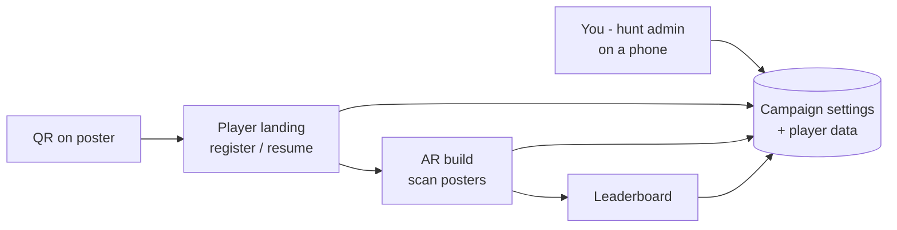
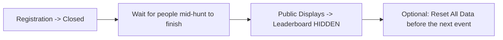

# Running an ARRISE Event

> **Job:** the event-day runbook. Written for the person standing at the booth
> with a phone - what to set before doors, which one control to tap when
> something goes wrong, how to hand out prizes, and what you can honestly
> promise a brand.
> **Update when:** an operator-facing control changes, or an event turns up a
> failure that is not in the troubleshooting table.
> **Do NOT put here:** how the engine works internally (that is
> [HUNT_ENGINE.md](HUNT_ENGINE.md)) or how a build is made
> ([ARCHITECTURE.md](ARCHITECTURE.md)).

You do not need to be a developer to run an event. Everything below is done in
a browser on your phone. Nothing here requires a rebuild, and every control is
reversible.

One idea makes the rest make sense:

**The server owns the campaign. The build only recognises pictures.**

Labels, clues, scoring mode, which posters are live, whether sign-ups are open,
branding, ads - all of it lives in the admin panel and changes for everyone
within seconds. If someone tells you a text change needs a new build, they are
wrong.

---

## 1. The four URLs

| Page | URL | Who opens it | What it is for |
|---|---|---|---|
| **Player landing** | `https://dashboard.rionick.com/hunt/` | Visitors, from the QR on every poster | Register (name, phone, consent), or resume a lost session. Hands the player over to the AR build. |
| **AR build** | `https://rionick.com/AR/memehunt/` | Opened automatically by the landing page | The camera experience. Chips, timer, clues, memes, completion card. Do not print this URL on posters. |
| **Leaderboard** | `https://dashboard.rionick.com/hunt/leaderboard.html` | Players, and the booth screen | Top 10, live activity feed, the visitor's own rank. Add `?tv=1` for the booth screen. |
| **Hunt admin** | `https://dashboard.rionick.com/hunt/admin.html` | You | Everything in this document. |

**The QR on the printed poster must point at the landing page, not at the AR
build.** A player who lands straight on the AR build has no session: they get a
registration gate instead of a camera, which reads as broken.

**Login:** the hunt admin uses the same account as the main ARRISE admin panel.
Type either the username or the account email. If you are already logged into
the main panel on that phone, the hunt admin opens straight in.

The admin page refreshes itself every 15 seconds, so two staff phones stay in
sync without anyone pressing Refresh.

---

## 2. Before doors

Do these in order. Steps 1 and 10 are the two that ruin an event when skipped.

### 2.1 Load the poster list from Unity

`breaks the whole hunt if skipped`

The AR build has its own internal name for each poster, baked in when it was
built. The server scores against the list *you* give it. If those two lists
disagree, **the meme still plays and the chip never ticks** - the most
confusing failure this platform has.

In Unity: **Tools > Meme Hunt > 3. Copy Poster List JSON**. That copies the
built scene's real poster ids to the clipboard and writes `hunt-posters.json`
at the project root. Paste it into **Settings > Poster list** and Save. The
panel shows you the ids it accepted and confirms "saved list" rather than
"built-in default".

Anyone can do this without Unity by sending you `hunt-posters.json` from the
repo root - a plain text file of `{"id":..., "label":..., "hint":...}` entries.

The server's own built-in list (`FIFA_Target`, `One8Traget`, `BookCover`,
`CultGym`, `Shoes`) is from the old test build. **If you see those ids live and
your posters are the new ones, nothing anybody scans will count.**

Changing the poster list mid-event invalidates hunts already in progress - do
it before doors, then Reset All Data.

### 2.2 Labels and hints

Under Settings, each poster gets:

- **Label** - the short caption on the player's chips, up to 20 characters.
- **Hint** - the clue shown *after the previous poster is found*, up to 300
  characters. Write it as directions a stranger can follow: "near the food
  court entrance, next to the blue pillar".
- **Up / down arrows** next to each poster id reorder the hunt. They save
  instantly and are safe mid-event - players keep every scan they already have.

All of it is editable during the event from your phone. Walk the venue once and
fix the hints that turn out to be wrong.

### 2.3 Choose the mode

Admin panel: **Settings -> Event Mode**.

| Mode | Ranked by | Use it when |
|---|---|---|
| **Timed** (default) | Fastest total time | You want a race and a clear winner. Trade shows, competitive crowds. |
| **Untimed** | Who finished first, no clock | You want people to explore, not sprint. Families, long venues. |
| **Points** | Total score, each poster carries a points weight | Engagement events - weight the stalls that paid more, and players are ranked as they go, without finishing. |

In Points mode set each poster's **Points** value in the Settings poster rows.
In Timed and Untimed the Points column is ignored.

### 2.4 Anti-cheat floors

Two numbers, both under Settings:

- **Min total time (seconds)** - a completion faster than this gets flagged.
- **Min gap between posters (seconds)** - two scans closer together than this
  gets flagged.

**How to set them:** walk the real route yourself at a brisk pace and time it.
Set the total floor to roughly 60-70% of your honest time, and the gap floor to
about half of your fastest walk between two adjacent posters. Too high and you
flag honest players; too low and it catches nobody.

A flagged player is marked **SUSPECT** in your table and is **hidden from the
public leaderboard and the live feed** until you press Verify. They are not
blocked - they keep playing and never see the flag. The total-time floor
applies in Timed mode only; the gap floor applies in every mode.

### 2.5 Next Clue delay

**"Next Clue" button delay (seconds after scan)** - how long the meme gets to
play before the player can move on. Set it to roughly the meme length minus one
second. Too short and nobody watches the content; too long and it feels stuck.

### 2.6 Sequential or any order

**Sequential** forces posters to be found in the listed order. Use it when the
route has a natural path and you want to control crowd flow; leave it off when
posters are spread across a hall and queues would form. With it on, a player
who scans out of order is told which poster to find next, and their clock does
not start on the rejected scan.

### 2.7 Branding

Settings > Branding sets the event name, dates and venue line, brand name, hunt
title, accent colour, powered-by footer, and the leaderboard call-to-action -
driving the AR overlay, the landing page, the leaderboard and the shareable
victory card in one go.

In **Brand name**, the part after the `|` is drawn in the accent colour:
`AR|RISE` renders "AR" in white and "RISE" in red. The CTA link must start with
`https://` or it is ignored.

### 2.8 Sponsor ads

Up to four full-screen closeable images, each with an optional click-through
link. They rotate: ad 1 after the first scan, ad 2 after the second, and so on;
fewer ads simply repeat. They **never** appear before the first scan and
**never** on the completion screen.

Image URLs must start with `https://`. Upload the images into the `hunt/`
folder using the hosting file manager, then paste their URLs. Leave every image
field empty to disable ads.

### 2.9 Unlock codes and stall offers (optional - see section 6)

Each poster row also has:

- **Unlock code** - a word or number the visitor must type for the poster to
  count. Only the stall staff know it. Leave empty for a free scan.
- **Stall offer** - text shown to the player right after they scan that poster
  ("show this screen at the counter for a free sample").

The code is never sent to players' phones. Wrong code shows "that code is not
right - check with the stall" and records nothing.

### 2.10 Reset All Data

`deletes everything - do it before doors, never during`

**Reset All Data** wipes every participant and every scan, including your test
runs. You must type `RESET` to confirm. Do this once, after you have finished
testing and before the first real visitor.

It does **not** clear your settings - poster list, labels, hints, floors, mode,
branding and ads all survive.

### 2.11 Booth screen

On the booth laptop: Chrome -> `leaderboard.html?tv=1` -> F11 for fullscreen.
`?tv=1` scales the page 1.6x so it reads from across an aisle. Tap the bell icon
once, by hand, so the browser allows the finish chime - browsers block sound
until a real click happens, so this cannot be automated.

### 2.12 Final checks

1. Registration card shows **Registration OPEN**, every target shows **OPEN**.
2. Scan one poster yourself end to end, then Remove your own row.
3. Posters printed matte at A3 or larger. Glossy paper under venue spotlights
   is the single most common tracking failure.
4. Booth phones charged, and a power bank at the help desk.

---

## 3. During the event: which control, when

Every control on the admin page is one tap, applies to everyone within seconds,
deletes nothing, and can be undone.

| What just happened | Tap this | What players see |
|---|---|---|
| A poster is torn, stolen, or its area is blocked | **Targets** card -> that poster -> Close | It vanishes from their chips. The counter becomes x/(remaining). Nobody needs it to finish. |
| The area reopened / poster reprinted | **Targets** card -> that poster -> Open | It comes back, and everyone who had already scanned it gets their credit back instantly. |
| Someone lost their session, closed the tab, or switched phone | Send them to the landing page -> "Already registered? Resume" | They resume with everything they had. |
| A run looks impossible | Their row shows **SUSPECT** already | They are already off the public board. Verify in person before awarding. |
| A staff or test run is sitting in the prize positions | **Remove** on that row | Ranks below shift up instantly. |
| Board looks empty early on, and it is discouraging people | **Add Player to Leaderboard** | Seeds a finished entry so the board is not blank. |

### 3.1 Poster damaged, or an area is blocked

The **Targets** card lists every poster as a button. Tap one to close it.

**What closing actually does:** the poster disappears from every player's chips,
stops being required to finish, and the sequential order skips over it. Scans
already recorded are **kept** - reopening restores everyone's credit. A player
who already holds all the remaining open posters is finished automatically, and
their finish time is taken from their **last scan**, not from the moment you
closed the target - so nobody is punished for the time between. The last
remaining open target cannot be closed; the panel refuses and tells you to
reopen another first.

### 3.2 Someone lost their session

Send them to the landing page and tap "Already registered? Resume your hunt".
They need their **name**, plus **either**:

- the **phone number** they registered with, or
- their **5-digit player code**.

The name must match what they registered with, either way - a phone number
alone will not hand over somebody else's session.

If they remember neither, find them in your admin table by name; the table
shows both their phone and their code. If they typed a wrong code several
times, the server may make them wait a few minutes - that is the brute-force
guard, and it clears itself. The AR page's own gate carries the same "Already
registered? Resume your hunt" link.

### 3.3 Someone looks like a cheat

You do not have to spot this yourself. A run that beats your floors is
auto-flagged **SUSPECT** and is already invisible on the public leaderboard and
the live feed. It stays visible to you.

To clear it: ask them, in person, to scan one poster in front of you. If they
can, press **Verify** on their row. That clears the flag and puts them back on
the public board. Pressing Verify again removes verification and re-runs the
check.

**Verify every prize winner in person, flagged or not.** Scans are asserted by
the phone; the in-person check is the real control.

### 3.4 Seeding the board (optional)

**Add Player to Leaderboard** inserts a finished, pre-verified run - for when
the board is empty in the first half hour and that is putting people off. The
**Generate** button fills the form with a plausible name and time to review
before adding. Two rules:

- **Leave the phone field empty.** The server then assigns a number starting
  `00`, which no real phone can produce - that is how you spot seeded rows
  later, and it means you cannot accidentally block a real visitor from
  registering.
- **Do not touch the Verified button on a seeded row.** Switching it off can
  hide the entry as SUSPECT.

Seeded rows are marked **ADDED** in your table only. On the public board they
look like any other player.

---

## 4. Prizes

1. Sort by rank in the admin table - rank 1 is at the top.
2. Ask the claimant for their **5-digit player code** and find that row. The
   code beats searching by name (duplicates) or phone (nobody remembers it).
3. Verify in person: ask them to scan any one poster while you watch.
4. Press **Verify** on their row. If they were flagged SUSPECT, this also puts
   them back on the public leaderboard.
5. Award the prize.
6. Before awarding, scan the table for the same person appearing under two
   phone numbers. Multiple numbers means multiple attempts, and the system
   does not prevent it.

**Export CSV** downloads the full table including the Code column - useful as a
record after the event, and as the list you reconcile prizes against.

---

## 5. Wrapping the event

Do these two in order. They are separate controls because they do different
things.

| Control | New visitors see | People already mid-hunt |
|---|---|---|
| **Registration -> Closed** | "This hunt has ended" instead of the sign-up form. They cannot join. | **Nothing changes.** They resume, scan, finish, and the leaderboard keeps updating. |
| **Leaderboard -> HIDDEN** | The leaderboard page swaps the rankings, the live feed and the "your rank" card for a "The Hunt Is Over - back soon" card. | They can still scan and finish. Their own time and rank still appear inside the AR experience. Only the public page changes. |
| **Live Feed -> HIDDEN** | The activity ticker disappears. Rankings stay up. | No effect at all. |

So: **close registration when the campaign ends, and hide the leaderboard only
once play has actually stopped.** Hiding the board while people are still
hunting takes away the thing they are hunting for.

Everything here is reversible - reopening a display shows every ranking again,
nothing was deleted. Before the *next* event, run **Reset All Data** to clear
players while keeping your settings.

---

## 6. What you can honestly sell a brand

This section exists because a stall owner once complained, correctly, that
visitors scanned his poster and walked away.

### What the platform actually delivers

| Promise | How it is delivered | Where the proof is |
|---|---|---|
| **Footfall to a specific stall** | Their poster is a required stop on the route. Players must physically stand in front of it. | Their row in the admin table; the per-poster scan count. |
| **A lead list per stall** | Everyone who scanned that stall's poster, with contact details. | **Stall Leads (per poster)** -> pick the stall -> Download CSV. Columns: Name, Phone, Company, Business Type, Scanned At, Player Code. |
| **Dwell at the poster** | The AR build reports how long each target stayed in view. | The ARRISE analytics dashboard, `ar_scan_duration` per target. |
| **Brand recall** | Their content plays full-screen on the visitor's own phone for several seconds, with sound. Plus optional full-screen sponsor interstitials between clues. | Scan counts, plus the dwell figure above. |
| **Reach beyond the hall** | The completion screen generates a personalised victory card the player shares to WhatsApp, carrying the event and brand name. | Anecdotal - shares are not tracked. Do not put a number on this. |

### What it does not deliver

**A purchase.** No point-of-sale integration, no redemption tracking, no way to
prove a scan turned into a sale. If a brand asks for conversion, the honest
answer is: we deliver a qualified visitor to the counter with their phone
already out, and hand you their contact details. Closing them is the stall's
job.

**Verified attendance.** A scan means a phone saw that image. It does not prove
the person stood at the stall rather than photographing the poster elsewhere.

**A guaranteed conversation with staff** - unless you use the play below.

### The play for "they scanned and ran"

This is what the unlock code and stall offer fields exist for.

1. Set an **unlock code** on that brand's poster. The poster does not count
   until the visitor types it.
2. The stall staff hold the code. The only way to get it is to walk up and ask.
3. Set a **stall offer** on the same poster - the text shown right after the
   scan lands ("show this screen for a free sample").
4. In Points mode, give that poster a heavier **points** weight so it is worth
   the detour.

The visitor now has to talk to a human before their scan counts. That is a
conversation you can honestly sell, and it is measurable: everyone in that
stall's leads CSV completed the code step.

Be straight about the cost: a gated poster is slower and slightly more
frustrating than a free one. Do not gate every poster. One or two paying stalls
is the right number.

---

## 7. Troubleshooting

| Symptom | Likely cause | Fix |
|---|---|---|
| **The meme plays but the chip never ticks.** Every poster, every player. A message flashes about an unknown poster. | The poster ids in Settings > Poster list do not match the ids inside the AR build. The server is scoring against a different list. | Get `hunt-posters.json` from the build (Unity: **Tools > Meme Hunt > 3. Copy Poster List JSON**), paste it into **Settings > Poster list**, Save, then **Reset All Data**. Check the panel says "saved list", not "built-in default". |
| **No registration screen at all.** The AR page loads and tracks posters, but there are no chips, no timer, no sign-up gate. | The build shipped with the campaign switched off - `window.HUNT_CONFIG = { enabled: false };` in the build's `index.html`. | In the hosting file manager, open `index.html` in the deployed AR build folder, change `enabled: false` to `enabled: true`, save, and hard-reload. No rebuild needed. For the permanent fix the scene needs `huntEnabled` ticked on its `CampaignSettings` before the next build. |
| **A poster tracks but the video never appears** (black or blank plane). | The video file was never pushed to GitHub, or the CDN is still serving the old version of that path. | Confirm the file is committed and pushed under `videos/`. jsDelivr caches an `@main` URL for up to 12 hours, so a just-pushed file can still 404. Ask a developer to purge that URL, or wait it out. Meanwhile close that target so the hunt continues on the rest. |
| **Video plays with no sound on iPhone.** Android is fine. | Apple blocks audio until the user taps. The build shows an "Enable Sound" card for exactly this. | Tell the player to tap the Enable Sound card. If they missed it, tapping anywhere on the screen usually unlocks it. Also check the phone's physical silent switch - it mutes web video on iOS. |
| **A player swears they registered, but the site shows the sign-up form.** | Different browser, cleared storage, or they opened the link from inside another app. | Landing page -> "Already registered? Resume" -> name plus phone **or** 5-digit code. |
| **"This phone number is already registered under a different name."** | Someone else used that number, or they typed their name differently from registration. | Look their number up in your admin table to see the registered spelling and tell them to use it. If it is genuinely a stale test row, **Remove** it and let them register again. |
| **A poster is missing from the players' chips.** | It is closed in the Targets card. | Targets card -> tap it -> Open. Everyone's earlier scans come back with it. |
| **Someone finished but is not on the public leaderboard.** | They were flagged SUSPECT by the anti-cheat floors. | Their row shows SUSPECT. Verify them in person, press **Verify**, and they appear. If honest players are being flagged all day, your floors are set too high. |
| **The booth screen is tiny / has no sound on new finishes.** | `?tv=1` missing, or the browser has not been given a click. | Use `leaderboard.html?tv=1` in Chrome, press F11, and tap the bell icon once by hand. |
| **Admin page keeps bouncing to the login screen.** | The session token expired. | Log in again with the same username or email. |
| **A settings change has not reached a player.** | Their screen was already open. | Settings reach a player on their next scan or page load, not retroactively. Ask them to reload, and press Refresh in the admin bar to confirm the value saved. |

### When something is genuinely broken and you need to buy time

Close the affected target. The hunt continues on the remaining posters, nobody
is stuck, nothing is lost, and you can reopen it the moment it is fixed. That
one button is your fallback for almost every physical problem at the venue.

---

## 8. Honest limits - tell your client before, not after

Scans are asserted by the player's phone. There is no cryptographic proof the
camera saw the poster. That means:

- A determined person can forge scans by calling the API directly. The
  SUSPECT floors and your in-person verification are what catch it - they do
  not prevent it.
- A photographed poster can be scanned off another phone's screen. The min-gap
  floor catches the fast version; the in-person check catches the rest.
- More phone numbers means more attempts. Check the table for the same name
  appearing twice before awarding prizes.

The system also collects real personal data - names and phone numbers, with
consent. **Phone numbers appear only on the admin pages and in the CSV
exports.** The public leaderboard and live feed show first names only. Treat
the exported CSVs the way you would treat any customer list.
