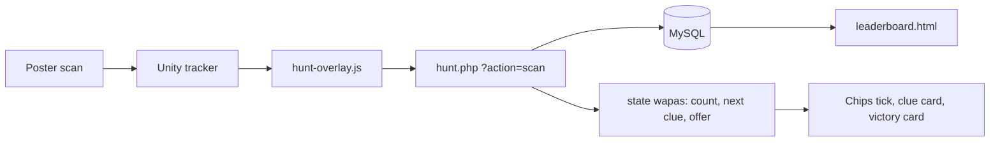

# ARRISE WebAR Platform - Project Explained in Hinglish

> **Job:** poore project ko easy Roman Hindi me samjhana - kaunsa hissa kya karta
> hai, signal kahan se kahan jata hai, aur kaam kahan se shuru karein.
> **Update when:** koi naya system add ho, ya koi flow badal jaye.
> **Do NOT put here:** deep engineering detail. Wo [ARCHITECTURE.md](ARCHITECTURE.md)
> aur [HUNT_ENGINE.md](HUNT_ENGINE.md) me rehta hai. Ye guide sirf samajh ke liye hai.

Ye practical onboarding guide hai. English docs se pehle ise padh lo - poora
system 20 minute me samajh aa jayega, phir detail ke liye baaki docs kholo.

## Live project snapshot

- Unity version: **6000.3.9f1**
- Custom Unity scripts: **8 runtime + 11 editor**
- Campaign engine: `ar-analytics/api/controllers/hunt.php` (~1,766 lines)
- Player overlay: `Assets/WebGLTemplates/iTracker/hunt-overlay.js` (~1,507 lines)
- Detailed engineering source: [ARCHITECTURE.md](ARCHITECTURE.md)
- Campaign engine source of truth: [HUNT_ENGINE.md](HUNT_ENGINE.md)
- Event chalane wali guide: [OPERATIONS.md](OPERATIONS.md)

---

## 1. Project ko ek line me samjho

Ek printed poster ko phone camera se scan karo, uske upar AR content chalta hai,
aur us experience ke upar ek pura campaign (registration, scoring, clues, prizes)
chalta hai - jo event ke beech me bhi phone se control ho sakta hai, **bina
rebuild ke**.

| System | Is project me responsibility |
|---|---|
| Unity + Imagine WebAR Image Tracker | Camera se poster pehchanna, uske upar 3D/video content dikhana |
| WebGL template (`iTracker`) | Build ka HTML page - camera, tracker script, aur overlay ko load karta hai |
| `hunt-overlay.js` | Player ko dikhne wali campaign UI - chips, timer, clue card, code prompt, victory card |
| `hunt.php` (PHP + MySQL) | Saare rules: kaun register hua, kya scan hua, score, rank, admin controls |
| `hunt/` HTML pages | Landing (register/resume), leaderboard (booth screen), admin (operator) |
| jsDelivr CDN | Meme videos aur ad images serve karta hai (GitHub repo se) |

```text
Poster  = physical trigger
Unity   = poster pehchano aur content chalao
Overlay = game/campaign ka UI
hunt.php= rules, score aur authority
Admin   = event ke time live control
```

---

## 2. Zaroori words

### Image target
Wo poster/image jise tracker pehchanta hai. Har target ki ek **id** hoti hai
(jaise `Target1`). Ye id Unity build me bake ho jati hai - server aur build me ye
id **bilkul same** honi chahiye, warna meme to chalega par scan count nahi hoga.
Ye sabse common silent bug hai.

### Overlay
Build ke upar chalne wali JavaScript layer. Unity ko pata hi nahi ki koi hunt
chal raha hai - overlay hi camera events sun kar server ko batata hai.

### Settings (server-side)
`hunt_settings` table ek key-value JSON store hai. Poster labels, hints, mode,
branding, ads, unlock codes - sab yahin rehta hai. Isi wajah se event ke beech
me sab kuch phone se badla ja sakta hai.

### Mode
Campaign kis tarah rank karega:

| Mode | Jeetne ka rule | Kab use karo |
|---|---|---|
| `timed` | Sabse tez total time | High energy, viral race (default) |
| `untimed` | Jo pehle finish kare, bina clock ke | Relaxed expo, pressure nahi |
| `points` | Har poster ke points ka total | Brand engagement events |

### Unlock code
Kisi poster par optional 4-6 letter/number ka code laga sakte ho. Us poster ka
scan tabhi count hota hai jab visitor **stall staff se code maang kar** enter
kare. Isi se visitor ko brand se baat karni padti hai - warna log sirf scan karke
bhaag jate hain.

---

## 3. Signal flow - poster se leaderboard tak



Step by step:

1. Player poster par phone rakhta hai. Unity tracker target pehchanta hai.
2. Overlay ka `onImageFound(id)` chalta hai.
3. Agar poster par unlock code laga hai -> overlay code prompt dikhata hai.
   Bina sahi code ke server kuch **record hi nahi karta**.
4. Overlay `?action=scan` bhejta hai (token + poster_id + optional code).
5. Server check karta hai: poster valid hai? open hai? sequential order sahi hai?
   code sahi hai? Phir scan row likhta hai aur timer start karta hai.
6. Server poora state wapas bhejta hai - count, total, next clue, score, offer.
7. Overlay chips tick karta hai, clue card dikhata hai, aur agar sab poster ho
   gaye to victory card banata hai.

**Timer pehle scan par start hota hai**, register par nahi - taki app download
karne ka aur poster 1 tak chalne ka time count na ho.

---

## 4. Custom scripts - kis file ka kya kaam

### Unity runtime (`Assets/Scripts/`)

| Script | Kaam |
|---|---|
| `CampaignSettings.cs` | Scene khud batati hai ki wo hunt hai ya normal AR card. Build time par ye flag page me likha jata hai |
| `CDNARVideoController.cs` | Target ka video CDN se stream karta hai (build size bachane ke liye) |
| `ARContentScale.cs` | URL me `?scale=` se AR content ka size adjust karta hai |
| `ShareManager.cs` | Victory card / content share karne ke liye |
| `UIManager.cs` | Scene ki UI handling |
| `RotateAndAutoReset.cs`, `SliderAnimationController.cs`, `ExampleUsage.cs` | Content ke chhote behaviours |

### Unity editor tools (`Assets/Editor/`)

| Script | Kaam |
|---|---|
| `MemeHuntSceneBuilder.cs` | Poster folder se poori Meme Hunt scene bana deta hai - poster daalo, rebuild karo, baaki automatic |
| `RishabhSceneBuilder.cs` + `RishabhLayoutTools.cs` | AR visiting card scene aur uska layout round-trip tool |
| `ARCardSetupWindow.cs` | Naya AR card setup karne ki window |
| `HuntFlagPostBuild.cs` | Build ke baad page me `window.HUNT_CONFIG` likhta hai (hunt on/off) |
| `AnalyticsKeyPostBuild.cs` | Build ke baad analytics project key likhta hai |
| `BootSceneCampaign.cs` | Agar Unity ka scene callback na chale, to scene file **disk se** padh leta hai - ye safety net hai |
| `PreBuildCheck.cs`, `PreBuildDialog.cs` | Build se pehle galtiyan pakadta hai |

> **Yaad rakho:** `BootSceneCampaign.cs` isliye bana kyunki Unity ka
> `[PostProcessScene]` callback hamesha nahi chalta. Ek baar wo skip ho gaya aur
> build me registration screen hi nahi aayi - live event me. Ab callback na chale
> to bhi sahi value milti hai, aur na mile to **red error** aata hai.

### Backend (`ar-analytics/api/controllers/`)

| File | Kaam |
|---|---|
| `hunt.php` | Poora campaign engine - registration, scan, score, rank, admin controls |
| `track.php`, `pixel.php` | Analytics events |
| `auth.php` | Admin login |
| `dashboard.php`, `admin.php` | Analytics dashboard |

---

## 5. Admin panel - event ke time ke controls

Sab ek tap me, sabke liye turant live, aur sab **reversible**:

| Control | Kya karta hai |
|---|---|
| **Registration Open/Closed** | Campaign khatam - naye log register nahi kar sakte, par jo khel rahe hain wo finish kar sakte hain |
| **Leaderboard show/hide** | Hide karne par "The Hunt Is Over - back soon" card dikhta hai |
| **Live Feed show/hide** | Booth screen ka ticker on/off |
| **Targets Open/Close** | Koi poster kharab ho gaya? Use band kar do - baaki poster se hunt chalta rahega |
| **Event Mode** | timed / untimed / points |
| **Per-poster**: label, hint, unlock code, points, offer | Har poster ki setting alag |
| **Stall Leads CSV** | Ek stall ke saare scanner ka lead list - yahi brand ko dena hai |
| **Add Player** | Leaderboard par demo entry |

### Target close karne ka rule (important)

- Poster band karo -> wo sabke chips se **gayab** ho jata hai, counter `x/4` ho jata hai
- Jo scan pehle ho chuke hain wo **delete nahi hote** - dobara open karo to credit wapas
- Jis player ke paas baaki sab poster hain, wo **apne aap complete** ho jata hai, aur
  uska finish time **aakhri scan** wala hi rehta hai (band karne ka time nahi)
- **Aakhri bacha hua target band nahi ho sakta**

---

## 6. Kya cheez rebuild mangti hai, kya nahi

Ye table sabse zyada time bachata hai:

| Change | Rebuild chahiye? |
|---|---|
| Poster label, hint, clue, mode, points, unlock code, branding, ads | **Nahi** - admin se turant |
| Registration band, leaderboard hide, target close | **Nahi** - admin se turant |
| PHP / admin / landing / leaderboard file | **Nahi** - sirf file upload |
| `hunt-overlay.js` | **Nahi** - wo ek file replace karo + `?v=N` badhao |
| Naya poster image, AR content, scene change | **Haan** - Unity rebuild |
| CDN video badla | **Nahi**, par GitHub push karo (jsDelivr 12h tak purana serve kar sakta hai) |

---

## 7. Anti-cheat kaise kaam karta hai

Scan events phone se aate hain - server ke paas koi proof nahi ki camera ne
sach me poster dekha. Isliye:

- **Min total time floor** - itni tezi se poora hunt possible nahi (sirf `timed` mode me,
  kyunki tezi tabhi shak ki baat hai jab speed se jeette hain)
- **Min gap floor** - do scan ke beech itna kam time physically possible nahi.
  Ye **har mode** me chalta hai, aur points mode me scan ke time par bhi -
  kyunki points mode me bina complete kiye bhi rank milti hai
- Pakde jane par `is_suspect` lag jata hai -> public leaderboard se hide
- Admin **Verify** dabaye to wapas dikhne lagta hai

Prize dene se pehle top 3 ko **saamne** ek poster dobara scan karwao. Yahi asli
control hai, software nahi.

---

## 8. Kaam kahan se shuru karein

1. **[OPERATIONS.md](OPERATIONS.md)** padho - ek event ka poora flow samajh aayega.
2. Admin panel kholo aur har control ko test data par chala kar dekho.
3. **[HUNT_ENGINE.md](HUNT_ENGINE.md)** me apni feature wali section padho.
4. Code chhune se pehle **[Engineering/WEBAR-TRAPS.md](../Engineering/WEBAR-TRAPS.md)**
   padh lo - wahan wo galtiyan likhi hain jo hum production me bhugat chuke hain.
5. Koi bhi change ke baad: server change = upload, overlay change = file + `?v=N`,
   Unity change = rebuild.

> **Ek baat honestly:** ye platform brand ko **footfall, dwell time aur lead
> list** de sakta hai - **sale nahi**. Stall owner ko yahi promise karo jo deliver
> ho sakta hai, aur engagement ke liye unlock code + offer wala setup use karo.
> Detail [OPERATIONS.md](OPERATIONS.md) ke "Selling to brands" section me hai.
