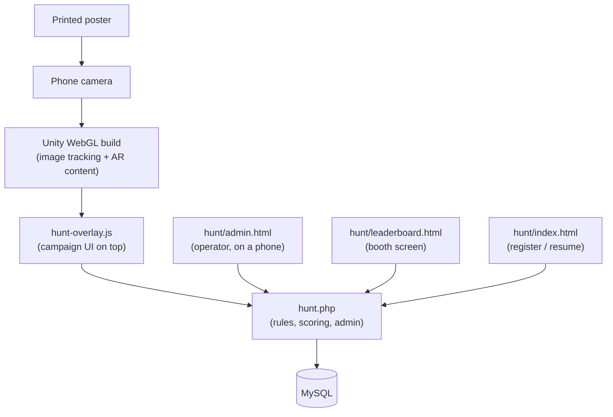

# ARRISE WebAR Platform - Developer Documentation

> **Job:** the entry point for the ARRISE platform - Unity WebGL image-tracking
> builds plus the PHP campaign backend that runs them.
> **Update when:** a document is added, renamed, or changes purpose.
> **Do NOT put here:** actual explanations. This file only routes you to the
> document that owns the answer.

This folder documents the code we wrote. The **Imagine WebAR - Image Tracker**
plugin, OpenCV.js, and the Unity engine keep their own vendor documentation and
are treated as replaceable packages behind our own boundaries.

## What this platform is, in one paragraph

A printed poster becomes an interactive experience. Unity builds a WebGL page
that tracks images through the phone camera; a JavaScript overlay on top of that
page runs the campaign (registration, scoring, clues, sharing); a PHP + MySQL
backend owns the rules, the data, and the live admin controls. The flagship
campaign type is the **AR Meme Hunt** - a poster-to-poster scavenger hunt run at
trade events. Everything a campaign needs at event time is changeable from a
phone, with **no rebuild**.

## New here?

Read **[Documentation/Engineering](../Engineering/README.md)** first. It is the
portable handbook for building WebAR on this stack - the traps that make correct
looking code behave wrongly, and why. It teaches the *stack*, not this codebase.
Come back here afterwards.

## Start here

| Document | What it answers |
|---|---|
| [ARCHITECTURE.md](ARCHITECTURE.md) | How a campaign is built and served: the four layers, the Unity build pipeline, the post-build injection, and the hard constraints that break a build when violated. |
| [HUNT_ENGINE.md](HUNT_ENGINE.md) | **Source of truth for the campaign engine.** Data model, every API action, the three event modes, unlock codes, admin controls, anti-cheat, and the honest limitations. |
| [OPERATIONS.md](OPERATIONS.md) | The event-day runbook, written for the person running the event from a phone - not for a developer. Includes what we can honestly sell to a brand. |
| [SCRIPT_CATALOG.md](SCRIPT_CATALOG.md) | Every custom source file, what it does, and which package it is allowed to touch. |
| [PROJECT_EXPLAINED_HINGLISH.md](PROJECT_EXPLAINED_HINGLISH.md) | The same project explained in easy Roman Hindi - the fastest way in if English docs slow you down. |

## The shape of the system

Read that top to bottom once. Almost every question is "which of those five
boxes owns this?", and the answer decides whether a change needs a Unity rebuild
or just a file upload.

## The one rule that saves the most time

**The server owns the campaign; the build owns the AR.**

Poster labels, hints, clues, scoring mode, unlock codes, branding, ads, which
targets are live, whether registration is open - all of it lives in the database
and changes instantly from the admin panel. The Unity build only knows how to
*recognise images and play content*.

So before you rebuild anything, ask: is this actually an AR change? If it is
text, rules, scoring, or availability, it is a settings change and you are about
to waste an hour.

## Deploying a change

| You changed | You must |
|---|---|
| `ar-analytics/**` (PHP, admin, landing, leaderboard) | Upload the file. Nothing else. |
| `hunt-overlay.js` | Replace that one file in the build folder **and** bump `?v=N` in the build's `index.html`. No Unity rebuild. |
| A Unity scene, target image, or AR content | Rebuild in Unity, then upload the build. |
| A CDN video or image | Push it to GitHub. jsDelivr `@main` can serve the old file for up to 12h - see [ARCHITECTURE.md](ARCHITECTURE.md). |

## Keeping this documentation current

There is **no generator**. These files are hand written, which means they rot
unless you maintain them. That is the trade: no tooling to install, no build step,
but you own the upkeep.

- Added or removed a source file -> update [SCRIPT_CATALOG.md](SCRIPT_CATALOG.md).
- Changed an API action, a settings key, or a scoring rule -> update
  [HUNT_ENGINE.md](HUNT_ENGINE.md). It is the source of truth; if the code and
  that document disagree, the document is a bug.
- Learned something the hard way in production -> write the rule into
  [Engineering/WEBAR-TRAPS.md](../Engineering/WEBAR-TRAPS.md) **with its
  mechanism**, while you still remember why it happened.
- Changed an operator-facing control -> update [OPERATIONS.md](OPERATIONS.md),
  because the person using it will not read the code.
