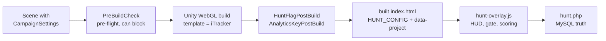

# ARRISE Script Catalog

> **Job:** one table of every file in this repo that Rionick Studios wrote, so a
> new developer can find the owner of any behaviour without opening 40 files.
> **Update when:** you add, rename, move or delete any file listed below.
> **Do NOT put here:** how the systems fit together (that is ARCHITECTURE.md),
> Unity rules and traps (that is ../Engineering/UNITY-TRAPS.md), or deployment
> steps (that is ar-analytics/DEPLOYMENT_GUIDE.md).

**This catalog is HAND-MAINTAINED. There is no generator.** Car Academy's
equivalent file is produced by a PowerShell script; this one is not. Nothing
will notice if it goes stale, so the rule is: **the commit that adds a file adds
its row here.** A row costs thirty seconds. A missing row costs the next person
an afternoon of grepping.

Covered here: `Assets/Scripts` (8), `Assets/Editor` (11), the parts of
`Assets/WebGLTemplates/iTracker` we own (2) plus the vendor files we must not
touch (3), `ar-analytics/api` controllers (6) and helpers (3), and the hunt
player/admin pages (3).

Not covered: `Assets/Imagine/**` (the licensed Imagine WebAR plugin),
`Assets/Plugins/**`, `WebGLBuild/**` (build output), and `ar-analytics/sql`,
`ar-analytics/tracker`, `ar-analytics/admin`, `ar-analytics/dashboard`.

---

## How a campaign gets built

Read this once and most of the table below explains itself. The scene decides
what kind of campaign it is; everything downstream reads that decision.

Two things are decided at BUILD time and cannot be changed afterwards: the image
target ids, and the two flags patched into `index.html`. Everything else - poster
labels, hints, points, branding, which targets are open - is live server settings.

---

## The table

| Area | File | Kind | Purpose | Depends on / boundary |
|---|---|---|---|---|
| Unity runtime | [ARContentScale.cs](../../Assets/Scripts/ARContentScale.cs) | MonoBehaviour | Sets the AR content's `localScale` at `Start`, preferring `?scale=` (or `?ar_scale=`) from `Application.absoluteURL` over the baked value, clamped to `minScale`/`maxScale`. Must sit on a child object BETWEEN the tracker's target root and the visible content: `ImageTracker.ParseData` hard-assigns the root's localScale every tracked frame, so a scale written there is wiped silently. | Imagine ImageTracker (as a constraint, not a reference) |
| Unity runtime | [CampaignSettings.cs](../../Assets/Scripts/CampaignSettings.cs) | MonoBehaviour (data only) | Declares, per scene, whether this is a hunt campaign (`huntEnabled`) and which analytics project it reports into (`analyticsApiKey`). No Update, no cost at runtime - it exists purely so the two post-build steps can read the answer off the scene instead of a human remembering it. Empty `analyticsApiKey` means "ship with no analytics at all". | Read by HuntFlagPostBuild, AnalyticsKeyPostBuild, BootSceneCampaign, PreBuildCheck |
| Unity runtime | [CDNARVideoController.cs](../../Assets/Scripts/CDNARVideoController.cs) | MonoBehaviour | Streams a CDN-hosted meme/product video onto a tracked plane. In `Awake` it moves the VideoPlayer onto a new `DontDestroyOnLoad` object and disables the original, because the tracker disables the tracked GameObject on loss and that would tear down the WebGL video buffer - the clone keeps buffering so a retrack resumes instantly. Also holds the renderer disabled until real frames arrive (white-flash guard), and mutes-then-unmutes for the iOS autoplay gate. | UnityEngine.Video, `Helpers.jslib` (`RequiresWebGLSoundUnlock`, `GetWebGLSoundUnlockSerial`, `SetWebGLCurrentTargetKey`) |
| Unity runtime | [ShareManager.cs](../../Assets/Scripts/ShareManager.cs) | MonoBehaviour | Calls a page-level JavaScript `shareText(text, url)` from WebGL builds. **Inert as shipped:** no `shareText` is defined anywhere in this repo, including the iTracker template, so both methods currently reach nothing. Define it in the template before wiring a share button. | `Application.ExternalCall` / `ExternalEval` (WebGL only) |
| Unity runtime | [ExampleUsage.cs](../../Assets/Scripts/ExampleUsage.cs) | MonoBehaviour | Sample wiring: clears a Button's listeners and points it at `ShareManager.ShareText` with a hard-coded example.com link. Reference material for the share flow, not a shipping component. | Unity UI, ShareManager |
| Unity runtime | [UIManager.cs](../../Assets/Scripts/UIManager.cs) | MonoBehaviour | Wires one "contact" button to `Application.OpenURL("https://rionick.com/contact-us")`. The other serialized fields (`firstCanvas`, `startButton`, `backButton`) are declared but unused. | Unity UI |
| Unity runtime | [SliderAnimationController.cs](../../Assets/Scripts/SliderAnimationController.cs) | MonoBehaviour | Toggles an Animator between `IsOn` and `IsOff` triggers on each button press. Generic UI helper, no AR knowledge. | Unity UI, Animator |
| Unity runtime | [RotateAndAutoReset.cs](../../Assets/Scripts/RotateAndAutoReset.cs) | MonoBehaviour | Lets the user spin an object with mouse or touch, then lerps it back to its start pose over `resetDuration` when they let go. Compiles the mouse path for `UNITY_WEBGL`, so on a phone browser it reads mouse axes, not touches. | Unity Input (legacy) |
| Unity editor | [MemeHuntSceneBuilder.cs](../../Assets/Editor/MemeHuntSceneBuilder.cs) | Scene generator | `Tools > Meme Hunt > 1/2/3`. Discovers posters from `Assets/AR_Assets/AR Meme Hunt` by leading number (the number IS the hunt order), clones `Demo-Video.unity`, strips its demo targets, rebuilds each poster procedurally, registers them in ImageTrackerGlobalSettings, adds `CampaignSettings` with `huntEnabled`, makes MemeHunt the only enabled build scene, and exports `hunt-posters.json` for the server. Idempotent - re-running deletes and re-clones. Adding a poster is copying a file in. | Imagine.WebAR, ImageTrackerGlobalSettings, CampaignSettings |
| Unity editor | [RishabhSceneBuilder.cs](../../Assets/Editor/RishabhSceneBuilder.cs) | Scene generator | `Tools > Rishabh > Build Rishabh Scene`. Builds the Rishabh AR visiting card from `Demo-VisitingCard.unity`: two targets (front and back of the printed card, each with a complete copy of the content), video plane, World Canvas of tappable link quads laid out from the CONFIG table, all links routed through `Imagine.WebAR.Samples.GoToUrl`. The analytics key is a constant in this file as well as on the scene's CampaignSettings, because a rebuild deletes the scene and would lose an inspector-only value. | Imagine.WebAR, Imagine.WebAR.Samples, CampaignSettings |
| Unity editor | [RishabhLayoutTools.cs](../../Assets/Editor/RishabhLayoutTools.cs) | Editor utility | Two commands that make hand-arranging the card survivable. `Sync UI To All Targets` copies the first target's arranged UI onto every other target (it never touches the video object, CDNARVideoController, materials, meshes or the Canvas components, and never saves the scene). `Read Layout From Scene` inverts the builder's own maths and rewrites `RishabhSceneBuilder.cs` between its AUTO markers, after a timestamped `.bak`, aborting without writing a byte if anything does not line up. | RishabhSceneBuilder.cs (edits its source text) |
| Unity editor | [ARAutomationWindow.cs](../../Assets/Editor/ARAutomationWindow.cs) | Editor wizard | `Tools > AR Setup Automation`. Step-by-step generator for a single-target AR video scene from `Demo-Video.unity`: validates and one-click-fixes texture Read/Write, sanitises the target id, checks the CDN URL, derives the video mesh from a first-frame image, and supports green-screen (parent = tracking quad, child = chroma-key video plane). Does NOT add `CampaignSettings` - a scene made here reports into the template's default analytics project until you add one. | Imagine.WebAR, UnityEngine.Video |
| Unity editor | [ARCardSetupWindow.cs](../../Assets/Editor/ARCardSetupWindow.cs) | Editor wizard | `Tools > AR Card Setup Wizard`. The visiting-card counterpart of the above, built from `Demo-VisitingCard.unity`: card background sprite, optional (green-screen) video overlay, and Instagram / Facebook / YouTube / website / phone / email / VCF link buttons. Same caveat - it does not add `CampaignSettings`. | Imagine.WebAR, Imagine.WebAR.Samples, UnityEngine.Video |
| Unity editor | [PreBuildCheck.cs](../../Assets/Editor/PreBuildCheck.cs) | Build gate | Pre-flight validation for every ARRISE WebGL build, wired through three doors: a `BuildPlayerWindow` handler installed by `[InitializeOnLoadMethod]`, `IPreprocessBuildWithReport` at `callbackOrder = -100`, and `[PostProcessScene(-100)]` as the authoritative net that throws `BuildFailedException`. Every check corresponds to something that has already shipped broken silently - missing CampaignSettings, an unregistered target, duplicate target filenames, a bad analytics key, the wrong WebGL template. Skipped in batch mode except for the PostProcessScene net. | UnityEditor.Build, Imagine.WebAR, CampaignSettings, PreBuildDialog |
| Unity editor | [PreBuildDialog.cs](../../Assets/Editor/PreBuildDialog.cs) | Editor window | The modal window PreBuildCheck shows: which campaign is shipping, hunt on or off, whose analytics project, then every issue with its one-click fix. Modal on purpose so a red banner cannot be scrolled past in the Console. Applying a fix mid-build CANCELS that build, because half-edited assets would be picked up inconsistently. Falls back to a native dialog if Unity refuses the custom modal. | PreBuildCheck types (`PreBuildIssue`, `PreBuildSummary`) |
| Unity editor | [HuntFlagPostBuild.cs](../../Assets/Editor/HuntFlagPostBuild.cs) | Post-build patch | `[PostProcessBuild(100)]`. Regex-rewrites `window.HUNT_CONFIG = { enabled: ... }` in the built `index.html` from the boot scene's `CampaignSettings.huntEnabled`. This is the switch that keeps the hunt HUD out of visiting-card and product builds, which share one template and one browser localStorage. When `[PostProcessScene]` did not run it falls back to BootSceneCampaign rather than defaulting to false. | CampaignSettings, BootSceneCampaign |
| Unity editor | [AnalyticsKeyPostBuild.cs](../../Assets/Editor/AnalyticsKeyPostBuild.cs) | Post-build patch | `[PostProcessBuild(101)]`. Rewrites the `data-project` attribute on the `ar-analytics.js` script tag from `CampaignSettings.analyticsApiKey`, so each campaign reports into its own project instead of the template's hard-coded one. An EMPTY key removes the whole script tag; no CampaignSettings at all leaves the tag as the template ships it. Validates the key shape (64 hex chars, matching `Auth::generateApiKey`). | CampaignSettings, BootSceneCampaign |
| Unity editor | [BootSceneCampaign.cs](../../Assets/Editor/BootSceneCampaign.cs) | Editor utility | Parses the boot scene's `.unity` YAML on disk to recover `huntEnabled`, `analyticsApiKey` and `campaignName` without the scene being open. Exists because `[PostProcessScene]` is NOT guaranteed to run - Unity skips it when an incremental build reuses cached scene data, and the two post-build steps then silently wrote "not a hunt" into a hunt build for six consecutive builds during a live event. Requires Force Text asset serialization; if that is off, `Found` comes back false and callers say so loudly. | EditorBuildSettings, text-serialized scenes |
| Unity editor | [CustomPlaneGenerator.cs](../../Assets/Editor/CustomPlaneGenerator.cs) | Editor utility | `Tools > Custom Plane Generator`. Makes a correctly-proportioned quad mesh from pixel dimensions (default multiplier `0.001`, so 1080 becomes 1.08 Unity units) in XZ-horizontal or XY-vertical orientation, exported as OBJ, FBX or a `.asset` mesh. Used to hand-make the video/tracking planes the wizards otherwise generate. | UnityEditor mesh/asset API |
| WebGL template | [hunt-overlay.js](../../Assets/WebGLTemplates/iTracker/hunt-overlay.js) | Ours - overlay | The entire Meme Hunt player experience, injected after `ar-analytics.js` and before the Unity loader. It wraps `window.arAnalytics` to intercept image-found events, so no C# change is needed to score a scan. Guarded by an explicit opt-in: without `HUNT_CONFIG.enabled === true` (or `?hunt=1`) it does nothing at all - no HUD, no network, no localStorage - and enablement is deliberately NOT inferred from a stored token, because every build on the domain shares one localStorage. Owns the token intake, the offline scan queue, the timer/points modes, poster chips, clue cards, unlock-code prompt, sponsor interstitials and the canvas-drawn victory card. | window.arAnalytics (Analytics.jslib), hunt.php, `HUNT_CONFIG` from index.html |
| WebGL template | [index.html](../../Assets/WebGLTemplates/iTracker/index.html) | Ours - page shell | The page every campaign ships as. Carries the ARRISE loading screen, the iOS sound-unlock overlay (whose state `Helpers.jslib` reads back into C#), the screenshot / confirm-URL / error panels, and the two lines the post-build steps patch. Its FIRST script is the AR watchdog: it catches opencv.js WASM aborts before Unity's loader can `alert()` on them, soft-restarts the tracker, silences benign `AbortError`/`NotAllowedError` media noise by attaching a no-op catch to `HTMLMediaElement.prototype.play`, and performs a budgeted automatic reload if the engine is truly dead. | Unity WebGL loader, arcamera.js, itracker.js, ar-analytics.js, hunt-overlay.js |
| WebGL template | itracker.js | **VENDOR** | Imagine WebAR - Image Tracker engine. Do not read, do not edit, do not document its internals here. Replaced wholesale on a plugin update. | Imagine WebAR licence |
| WebGL template | arcamera.js | **VENDOR** | Imagine WebAR camera/canvas layer. Same rule as above. | Imagine WebAR licence |
| WebGL template | opencv.js | **VENDOR** | OpenCV WASM build shipped with the plugin (~3.5 MB, the bulk of first load). Same rule as above; the watchdog in index.html exists because this can abort at runtime. | Imagine WebAR licence |
| Backend | [hunt.php](../../ar-analytics/api/controllers/hunt.php) | API controller | The whole hunt engine and by far the largest file in the repo. Public actions: `register`, `resume`, `start`, `scan`, `status`, `config`, `leaderboard`, `activity`. Admin actions (Bearer token): participants, CSV exports, verify, add/remove player, reset, settings, and live toggles for registration, public displays and per-target open/closed. Phone number is the unique participant identity; every scan is timestamped server-side; each poster counts once. The timer runs from FIRST scan to LAST, not from page load. Completions under `HUNT_MIN_TOTAL_MS` (60s) or with gaps under `HUNT_MIN_GAP_MS` (10s) are flagged `is_suspect` and hidden from the public board until an admin verifies. Resume-by-code is throttled to 50 failures per IP per 5 minutes because the 5-digit space is only 90 000 wide and names are public. Creates and migrates its own tables on demand. | Database, Auth, Response helpers; poster ids owned by Unity |
| Backend | [track.php](../../ar-analytics/api/controllers/track.php) | API controller | Public ingest for `ar-analytics.js`: `session`, `event`, `heartbeat`, POST-only. Authenticated by project API key (body or `X-API-Key`), never by user session - this is the endpoint the AR page itself calls. Derives IP and geo server-side. | Database, Auth::validateApiKey, Response |
| Backend | [pixel.php](../../ar-analytics/api/controllers/pixel.php) | API controller | The same three ingest actions as track.php, but as a GET request carrying base64 JSON in `?d=`, always answering with a 1x1 transparent GIF. Exists because the shared host (InfinityFree) blocks or mangles cross-origin POSTs; the image-beacon trick sidesteps both CORS and that restriction. Appends every request to `debug.txt` beside itself - remember that file exists before pointing production traffic at it. | Database, Auth::validateApiKey |
| Backend | [dashboard.php](../../ar-analytics/api/controllers/dashboard.php) | API controller | Read-only analytics for the client dashboard: overview, views-over-time, devices, browsers, locations, traffic, AR stats, sessions list, peak hours, languages, screen sizes, over a `range` of 24h/7d/30d/90d/365d. Enforces ownership at the top of the file - a `client` role can only ever reach its own projects, and falls back to its first project when none is named. | Database, Auth::requireAuth, Response |
| Backend | [admin.php](../../ar-analytics/api/controllers/admin.php) | API controller | Admin-only CRUD for clients, projects and admin users, plus an overview. Requires role `admin` or `super_admin`. Runs three inline "quick migrations" (`admins.role`, `clients.password_plain`, `admins.password_plain`) on every request, wrapped in try/catch - cheap on MySQL, but it means schema drift is repaired by traffic rather than by a migration step. | Database, Auth::requireAuth, Response |
| Backend | [auth.php](../../ar-analytics/api/controllers/auth.php) | API controller | Login for both audiences (`login` for clients, `admin-login` for staff), plus `me` and `change-password`. Issues the HMAC token every other controller verifies. | Auth helper, Database, Response |
| Backend | [Auth.php](../../ar-analytics/api/helpers/Auth.php) | Helper | Token and credential handling: `generateApiKey` (32 random bytes, hex - the 64-char shape AnalyticsKeyPostBuild validates), `generateToken`/`verifyToken` (base64 payload + HMAC-SHA256, compared with `hash_equals`), bcrypt password hashing, `requireAuth` with role check, and `validateApiKey` which also refuses keys belonging to a deactivated client. Reads the Authorization header from three places because shared hosts strip it. | Database, `api/config.php` (APP_SECRET, TOKEN_LIFETIME) |
| Backend | [Database.php](../../ar-analytics/api/helpers/Database.php) | Helper | Singleton PDO wrapper with `query` / `queryOne` / `execute` / `insert` / `scalar`. Prepared statements are real, not emulated (`ATTR_EMULATE_PREPARES => false`), which is what makes the parameterised calls throughout the controllers actually safe. A failed connection logs and exits 500 rather than throwing into a half-rendered response. | `api/config.php` (DB_*) |
| Backend | [Response.php](../../ar-analytics/api/helpers/Response.php) | Helper | The single JSON envelope (`{success, message, data}`) every controller answers in - `success()` and `error()` both `exit`, so calling one ends the request. Also owns the permissive CORS headers (the AR page is on a different origin) and the no-cache headers. | None |
| Player page | [index.html](../../ar-analytics/hunt/index.html) | Player page | The hunt landing page: registration form (name, phone, optional company/business type, consent), resume-by-code, and an "in progress" view. Derives its own API base from `location.pathname`, so it works at the domain root and in a subdirectory deploy. Pulls live branding, poster count and mode copy from `?action=config` before rendering. **`HUNT_AR_URL` at the top of its script block is empty and MUST be set to the deployed MemeHunt WebGL URL before an event** - the token is handed to the AR build as `?hunt_token=`, which is what makes it work cross-origin. | hunt.php (`config`, `register`, `resume`, `status`) |
| Player page | [leaderboard.html](../../ar-analytics/hunt/leaderboard.html) | Player page | Public rankings plus a live activity ticker, both re-fetched every 5 seconds. Highlights the viewer's own row from their stored token, and honours the admin's leaderboard-off and feed-off switches by showing a closing message instead of stale data. Phone numbers never appear here - the server does not send them on this endpoint. | hunt.php (`leaderboard`, `activity`, `status`, `config`) |
| Admin page | [admin.html](../../ar-analytics/hunt/admin.html) | Admin page | Single-file staff console for a live event: participant table with phone numbers, CSV exports (full and per-poster stall leads), verify/remove/add player, full reset, open/close individual targets mid-hunt, open/close registration, toggle the public displays, choose event mode (timed / untimed / points), paste the Unity poster-list JSON, edit white-label branding, and manage up to four sponsor ads. Logs in through `auth.php?action=admin-login` and sends a Bearer token on every call. **The poster-list box is the hand-off point from Unity:** leave it empty and the server stays on its built-in defaults, and every scan of a poster it has never heard of is rejected 400 while the video still plays - which looks like nothing at all going wrong. | hunt.php admin actions, auth.php |

---

## Adding a file

1. Write the file.
2. Add its row above, in its Area group.
3. Make the Purpose column a sentence that says what it does **and the one thing
   that is not obvious** - the constraint, the ordering, the failure it prevents.
   "Handles the video" is not a purpose. If you cannot name a non-obvious thing,
   say so plainly and keep the row short.
4. Update the counts in the header block.
