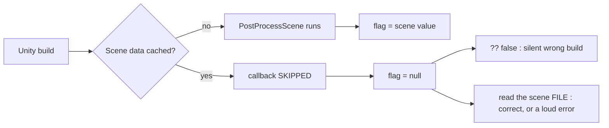
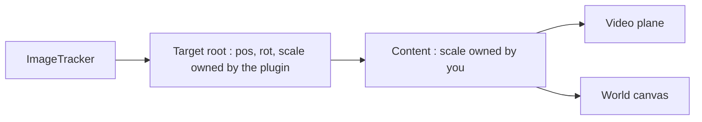

# WebAR Traps

> **Job:** the behaviours of this stack - Unity WebGL, a commercial image-tracking
> plugin, a JavaScript overlay and a PHP backend - that make correct-looking code
> behave wrongly. Build callbacks, vendor transforms, browser layout, CDNs, and
> data a phone asserts about itself.
> **Update when:** a defect is traced to a mechanism not described here, or a rule
> here turns out to be wrong.
> **Do NOT put here:** anything about one campaign, client or event. That belongs
> in the project's own documentation folder. How to read this folder is in
> [README.md](README.md).

Every rule below cost a production incident. Almost none of them threw an
exception. The build succeeded, the page loaded, the camera opened - and the
thing was broken in a way only a visitor could see.

---

## Build-time callbacks

### Never let a callback that did not run fall back to a plausible default.
`breaks things` · `junior trap`

**Why** - `[PostProcessScene]` runs once per scene *while that scene is loaded*
during a player build. Unity **skips scene processing when an incremental build
reuses cached scene data**. The callback does not fire, the static it fills stays
`null`, and the post-build step reading it takes its default branch. If that
default is a legal-looking value you have shipped a wrong build with a green
console. It also **does not self-correct** - once the scene stops being
reprocessed, every later build repeats the same wrong answer, so rebuilding is
not a fix.



```csharp
// WRONG - "did not run" and "declared off" are the same value
bool isHunt = bootSceneIsHunt ?? false;   // the whole incident lives on this line
WriteFlag(buildPath, isHunt);
```

```csharp
// RIGHT - separate "what it says" from "did anyone say anything",
// then read the source of truth, and fail LOUDLY if you cannot.
bool isHunt   = bootSceneIsHunt ?? false;
bool declared = bootSceneIsHunt.HasValue;

if (!declared)
{
    // Unity builds the player from the scene FILES, so parsing the file is
    // reading exactly what was built. A file read cannot "not happen".
    var disk = BootSceneCampaign.ReadFromDisk();
    if (!string.IsNullOrEmpty(disk.Error))
        Debug.LogError("[HuntFlag] Cannot tell whether this is a hunt build. " + disk.Error);
    else if (disk.Found) { isHunt = disk.HuntEnabled; declared = true; }
}

WriteFlag(buildPath, isHunt);
// Always state the decision AND its provenance: "flag = false" proves nothing,
// because false is often correct. The diagnostic value is in "read from".
Debug.Log("[HuntFlag] hunt=" + isHunt + "  scene=" + scenePath + "  read from=" + source);
if (!declared)
    Debug.LogError("[HuntFlag] No campaign settings readable - hunt switched OFF by default.");
```

*Seen in the field:* on ARRISE, `HuntFlagPostBuild` learned "is this the Meme
Hunt?" from `[PostProcessScene]`. Incremental builds stopped reprocessing the
scene, the flag defaulted to `enabled: false`, and six consecutive builds shipped
to a live event with no registration, no chips, no timer and no scoring - a
healthy-looking AR page with the whole game missing. The Editor log said
`scene: <unknown>` every time, as a *warning*, which scrolled past. The fix is
`Assets/Editor/BootSceneCampaign.cs`: parse the boot scene's `.unity` file.

**Spot it:** grep build-time code for `??`, `GetValueOrDefault`, and
`if (x == null) x = <something reasonable>`. For every static a build callback
fills, ask: *what does the next step do when this callback never runs?*

---

## The plugin owns your transform

### Put your own scale on a child, never on the tracked target root.
`breaks things` · `junior trap`

**Why** - the tracker writes the target's transform from tracking data on every
tracked frame. In `ImageTracker.ParseData` (called from the JS `OnTrack` message)
the root is hard-assigned, not blended:

| Property | Written every tracked frame | By |
|---|---|---|
| `position` | yes | `target.position = newPos` |
| `rotation` | yes | `target.rotation = newRot` |
| `localScale` | yes | `Vector3.one`, or `(-1,1,1)` when the camera is flipped |

A scale set on the root in the Inspector, in `Start`, or by a tween therefore
survives exactly until the first frame the poster is seen - which is the only
moment anyone is looking. It reads as "my scale is ignored", never as "something
overwrites it".

```csharp
// WRONG - gone on the first tracked frame
targetRoot.transform.localScale = Vector3.one * 0.6f;
```

```csharp
// RIGHT - one child owns the scale; the plugin never reaches it
var content = new GameObject("Content");
content.transform.SetParent(targetRoot.transform, false);
content.transform.localScale = Vector3.one * ContentScale;   // all visible content parents here
```



*Seen in the field:* ARRISE puts `ARContentScale` on that child, so the number
can be retuned live with `?scale=0.55` in the page URL instead of costing a Unity
rebuild plus an upload per guess.

**Spot it:** any `localScale`, `position` or `rotation` write on an object the
tracker lists as a target. Read the vendor's per-frame method once and write down
what it assigns.

### Treat every vendor `GetComponent` as unguarded, and give the package what its code assumes.
`breaks things`

**Why** - vendor code is written against the vendor's demo scene:

```csharp
// vendor code - ImageTracker.Start(), an IEnumerator
foreach (var i in imageTargets)
{
    targets.Add(i.id, i);
    i.transform.GetComponent<Renderer>().enabled = false;   // no null check
    i.transform.gameObject.SetActive(false);
}
StartWebGLiTracker(serializedIds, name);                    // never reached
```

A target with a `MeshFilter` and no `MeshRenderer` throws a
`NullReferenceException` on that line. It happens inside `Start`, so the
coroutine aborts: the remaining targets are never registered and
`StartWebGLiTracker` is never called. **One missing component on one target kills
tracking for the whole page** - camera feed, loader and UI all normal, nothing
ever tracks.

```csharp
// RIGHT - the renderer is mandatory even though the poster art is never drawn
targetObj.AddComponent<MeshFilter>().sharedMesh = GetOrCreateMesh(w, h, id + "_TrackImg");
// ImageTracker.Start() does GetComponent<Renderer>().enabled = false with no null check.
targetObj.AddComponent<MeshRenderer>().sharedMaterial = mat;
```

**Spot it:** every target root built by hand. Generate targets from one builder
so the required components cannot be forgotten, and add a pre-build check for
"target with no Renderer".

---

## Streaming and page load

### Anything that starts a download in `Awake` must ship INACTIVE.
`breaks things` · `costly` · `junior trap`

**Why** - the order is the trap. Unity runs `Awake` and `OnEnable` on **every
active object**, then `Start`. A tracker deactivates its target roots in `Start`
- which is *after* all those `Awake`s have already run. So a target authored
active means:

1. `CDNARVideoController.Awake` runs, builds its persistent `VideoPlayer` and
   calls `Prepare()` - the CDN fetch starts immediately.
2. `OnEnable` runs and calls `Play()` - audio starts.
3. Only then does `ImageTracker.Start` set the root inactive.

On a five-poster hunt that is five video streams downloading, and five audio
tracks playing, over venue wifi before the visitor has scanned anything.
Deactivating in `Start` does not recall the bytes already in flight.

```csharp
// RIGHT - template convention, enforced by the scene builders.
// Target roots start INACTIVE; the tracker re-activates on tracking-found.
// BEHAVIOURAL, not cosmetic: an active root means every clip downloads and
// every meme's audio plays at page load, before anything is scanned.
targetObj.SetActive(false);
```

**Spot it:** grep `Awake` and `OnEnable` for `Prepare(`, `Play(`,
`UnityWebRequest`, `StartCoroutine(Download`. Every hit belongs on an object that
ships inactive, or the work belongs behind an explicit "activate me" call.

---

## Layout and measurement

### Clear `min-width` on any flex child that holds text.
`breaks things` · `junior trap`

**Why** - a flex item's default `min-width` is `auto`, which resolves to its
**min-content** size. The item refuses to shrink below its longest unbreakable
word, whatever `flex` says. It pushes past the container, the container (or an
ancestor with `overflow:hidden`) clips it, and the text is simply cut - no
scrollbar, no console warning. `overflow-wrap:anywhere` alone does nothing: the
item never gets narrow enough to need wrapping.

```css
/* WRONG - a long name is silently CUT OFF */
.fitem { display:flex; justify-content:space-between; gap:10px; }
.fitem > span:first-child { overflow-wrap:anywhere; }
```

```css
/* RIGHT - allow the shrink, then allow the wrap */
.fitem > span:first-child { min-width:0; overflow-wrap:anywhere; }
```

*Seen in the field:* on the ARRISE leaderboard this clipped participant names in
**two** places for the same reason - the live feed rows (`.fitem`, inside a
`#feedWrap` with `overflow:hidden`) and the "Your Rank" card (`.you-card`). The
HUD hint row in `hunt-overlay.js` needs the same `flex:1; min-width:0`.

**Spot it:** every `display:flex` whose children contain user-supplied text. A
child without `min-width:0` cannot shrink.

### Measure after you show it - a hidden element measures 0.
`breaks things` · `junior trap`

**Why** - `display:none` generates no box, so every size read is `0`. A
fit-to-width loop is written as `while (content > container)`, and `0 > 0` is
false: it exits immediately having done nothing, and the element then appears at
full size. It even *looks* like the routine works, because the next `resize` or
`orientationchange` re-runs it against a visible element - so the bug reproduces
only on first load.

| Read on a `display:none` element | Returns |
|---|---|
| `offsetWidth` / `offsetHeight` | `0` |
| `clientWidth` / `scrollWidth` | `0` |
| `getBoundingClientRect()` | all-zero rect |
| `getComputedStyle().fontSize` | real value - styles still resolve |

```js
// WRONG - render() runs from the boot path, before the row is shown
function renderChips() { chipsEl.innerHTML = html; fitChips(); }
applyState(res.data, false);      // -> renderChips() -> fitChips() on a display:none row
chipsEl.style.display = 'flex';   // too late
```

```js
// RIGHT - show first, then fit, and re-fit whenever the box can change
chipsEl.style.display = 'flex';
applyState(res.data, false);
window.addEventListener('resize', fitChips);
window.addEventListener('orientationchange', function () { setTimeout(fitChips, 250); });
```

**Spot it:** any fit/measure function called from a render function. Follow the
call chain to where the element is actually shown and check which happens first.

### Measure a centred row by summing its children, not with `scrollWidth`.
`breaks things`

**Why** - the scrollable overflow region is **clamped at the start edge** of the
padding box, so content pushed off the left (in LTR) is unreachable and is not
counted. `justify-content:center` splits the overflow evenly across both sides,
so `scrollWidth` only ever sees the right-hand half and under-reports the row's
true width by about half the excess. As a boolean "does it overflow" that is
tolerable; as a *size* it is wrong, and so is every decision derived from it -
how far to shrink, when to ellipsise, whether to change layout. The symptom is
items bleeding off **both** edges with nothing to scroll. On a `<canvas>` there
is no layout engine at all, so summing is the only option there in any case.

```js
// WRONG - a centred row's real width is not scrollWidth
while (row.scrollWidth > row.clientWidth && fs > MIN) { fs -= 0.25; setFs(fs); }
```

```js
// RIGHT - sum the children plus the gaps; that is the row's real width
function rowWidth(row) {
  var kids = row.children, w = 0;
  var gap = parseFloat(getComputedStyle(row).columnGap) || 0;
  for (var i = 0; i < kids.length; i++) { w += kids[i].getBoundingClientRect().width; }
  return w + gap * Math.max(0, kids.length - 1);
}
while (rowWidth(row) > row.clientWidth && fs > MIN) { fs -= 0.25; setFs(fs); }
```

*Seen in the field:* the ARRISE victory card drew its poster chips on a canvas at
a fixed 26px. Five real labels measured 1231px on a 1080px card, and centring
that bled chips off both edges of the image every player shares. The fix sums
`ctx.measureText` widths plus padding and gaps, then shrinks until the total fits
`W - 80`: 956px at 20px.

**Spot it:** `scrollWidth` used as a width rather than a yes/no, on any element
whose computed `justify-content` is `center`. Also any fixed font size on text an
admin can edit at runtime.

---

## Caching

### Pin third-party URLs to an immutable version; version-stamp your own files monotonically.
`breaks things` · `costly`

**Why** - CDNs cache by URL, and for how long depends on whether the URL names
something immutable. jsDelivr serves a *mutable* ref such as `@main` from the
edge for up to **12 hours**; an exact version such as `@4.4.0` is cached
effectively forever. So a `@main` URL means you push the fix, refresh your own
phone, see it work - and half the venue runs yesterday's file for the rest of the
day. You cannot tell which file a given phone holds, which makes every bug report
during an event unfalsifiable. Your own files next to `index.html` have the same
problem via the browser and any proxy between; the query string is what defines
"a different file".

| URL | Mutable? | Cached | Use for |
|---|---|---|---|
| `cdn.jsdelivr.net/npm/chart.js@4.4.0/...` | no | permanently | third-party libraries |
| `cdn.jsdelivr.net/gh/<user>/<repo>@main/x.mp4` | yes | up to 12h | content you will never hot-fix |
| `hunt-overlay.js` | yes | browser/proxy default | never |
| `hunt-overlay.js?v=26` | no, by convention | keyed to `v` | your own hot-fixable files |

Two habits make the query string trustworthy. **Bump it in the same commit as the
content** - a file changed without a bump is a file some phones will never fetch.
And **never reuse a number for different content**: `?v=17` must mean one exact
file forever, so go monotonic and never roll the number back, even to undo a
change. A revert is `v+1`, not `v-1`.

```html
<!-- WRONG - mutable third-party ref, and no version on our own file -->
<script src="https://cdn.jsdelivr.net/gh/acme/assets@main/vendor-lib.js"></script>
<script src="hunt-overlay.js"></script>
```

```html
<!-- RIGHT -->
<script src="https://cdn.jsdelivr.net/npm/chart.js@4.4.0/dist/chart.umd.min.js"></script>
<script src="hunt-overlay.js?v=26"></script>
```

*Seen in the field:* ARRISE keeps the overlay in four copies (two WebGL templates
plus two build folders), so the deploy step is "edit, sync all copies, bump
`?v=N` in every `index.html`, upload". Skipping the bump is the same incident
every time: the fix is on the server and nobody's phone has it.

**Spot it:** grep for `@main`, `@master`, `@latest` in any URL you might need to
fix during an event. Then diff the last deploy: did a versioned file change
without its `?v` moving?

---

## Client-asserted data

### Put a plausibility floor on the server - and make the floor match the ranking rule.
`breaks things`

**Why** - a scan is a `POST`. Nothing in it proves a camera saw a poster; anyone
with the network tab open can send five in a second. The defence is a server-side
floor on what is physically possible, checked where the server owns the clock.

The trap is the second half: a floor only defends **where the thing it measures
decides the ranking**, and only on **a code path the cheat reaches**. A
total-time floor ("nobody finishes five posters in under 60s") means nothing in a
points or untimed mode - there is no total time, and speed is not what wins.
Worse, a floor that runs only at *completion* never runs at all in a mode where
players are ranked before they complete: that whole mode is unprotected while the
code reads as though it is covered. Use an invariant that holds in every mode -
the minimum gap between two consecutive counted scans - and apply the
mode-specific floor only inside its mode.

```php
// WRONG - one floor, one field, one mode, and only at completion
function flagIfImplausible($db, $id) {
    $row = $db->queryOne("SELECT total_ms FROM hunt_participants WHERE id = ?", [$id]);
    if (intval($row['total_ms']) < HUNT_MIN_TOTAL_MS) { flag($db, $id); }
}
```

```php
// RIGHT - mode-specific floor guarded by the mode; universal floor always
function flagIfImplausible($db, $participantId) {          // at completion
    $row = $db->queryOne("SELECT total_ms FROM hunt_participants WHERE id = ?", [$participantId]);
    if (!$row || $row['total_ms'] === null) return;
    $floors  = huntFloors();                               // dashboard-tunable, not constants
    $suspect = (huntMode() === 'timed') && intval($row['total_ms']) < $floors['total'];
    if (!$suspect) { $suspect = hasGapViolation($db, $participantId); }
    if ($suspect) { $db->execute("UPDATE hunt_participants SET is_suspect = TRUE WHERE id = ?", [$participantId]); }
}

function flagGapOnly($db, $participantId) {                // at SCAN time
    // Points/untimed players are ranked publicly without ever reaching the
    // completion path, so the universal floor has to run here too.
    if (hasGapViolation($db, $participantId)) {
        $db->execute("UPDATE hunt_participants SET is_suspect = TRUE WHERE id = ?", [$participantId]);
    }
}
```

Flag, do not delete. A flagged run drops off the public board and stays visible to
staff, so a genuinely fast player can be verified in person and put back. A floor
with no human override turns your best participant into a support ticket.

**Spot it:** any validation reading a column only some modes populate (`total_ms`,
`completed_at`). Any check that runs only on the completion path, in a mode where
nobody has to complete. Floors belong in settings - the right value is measured by
walking the real route on the day.

### Return one generic failure message for a lookup, and throttle it.
`breaks things`

**Why** - a lookup that answers "no such code" differently from "wrong name" is
an **enumeration oracle**: sweep the code space with any name, keep everything
that comes back "wrong name", and you hold a list of live sessions. Combine that
with public data - a leaderboard prints the names - and one request per candidate
hijacks a named winner's session.

The wording is only half of it. Status code, response time and response length
leak the same distinction, so the two branches must be *literally the same
response*. And a five-digit code is a 90,000-key space: at one request per second
an unthrottled sweep finishes within a day. Throttle failed attempts per client,
keyed on `REMOTE_ADDR` - the TCP peer - never on a forwarded header the client
controls.

```php
// WRONG - two branches, two messages, two status codes = an oracle
if (!$existing) Response::error('No player with that code', 404);
if ($existing['name'] !== $name) Response::error('That name does not match this code', 409);
```

```php
// RIGHT - one branch, one message, one status, plus a per-IP budget
resumeThrottleGuard($db, $ip);                       // 429 once the budget is spent
$existing = preg_match('/^[0-9]{5}$/', $code)
    ? $db->queryOne("SELECT * FROM hunt_participants WHERE player_code = ?", [$code])
    : null;
if (!$existing || mb_strtolower(trim($existing['name']), 'UTF-8') !== mb_strtolower($name, 'UTF-8')) {
    resumeThrottleFail($db, $ip);
    Response::error('No match - check the name and 5-digit code you registered with.', 404);
}
resumeThrottleReset($db, $ip);                       // a real user never accumulates a budget
```

Size the budget against the venue, not the attacker: everyone behind one NAT
shares an IP, so 50 failures per 5 minutes lets a whole hall fumble freely while
a 90,000-code sweep takes days. Keep the throttle best-effort - a missing table or
a DB hiccup must never block a legitimate resume.

**Spot it:** two `error(...)` calls with different text in one lookup path. A
lookup keyed on a short numeric code with no per-client failure counter. Any
identifier that is both short and printed in public.

---

## How to add a rule here

A rule earns its place when it has cost something real and is not obvious from
the code.

1. **Heading = instruction.** "Clear `min-width` on flex children", not "About
   flex sizing"; a reader must be able to obey the heading alone. Tag the
   severity under it, plus `junior trap` when the code genuinely looks correct.
2. **State the mechanism in `Why`.** Which callback, which frame, which spec
   behaviour. A rule without a mechanism gets cargo-culted or ignored; neither is
   learning. If you cannot state it, you have not finished debugging.
3. **Wrong code, then right code.** Real code from the real fix, trimmed.
4. **Finish with `Spot it`.** The grep, the review question, or the check a tool
   could run. A rule nobody can find violations of is decoration.
5. **Keep it portable.** No client, campaign or event names in the rule itself -
   those go in a *"Seen in the field"* aside, and the rule must still stand with
   the aside deleted. Then add a row to the "I am about to..." table in
   [README.md](README.md), or nobody arrives here in time.
